# 知识库管理系统 管理端功能介绍

## 概述

知识库管理系统 是一个面向教育场景的知识库管理系统,支持文档管理、智能搜索、AI问答、资源推荐等功能。本文详细介绍管理端(教师/管理员)可使用的各项功能。

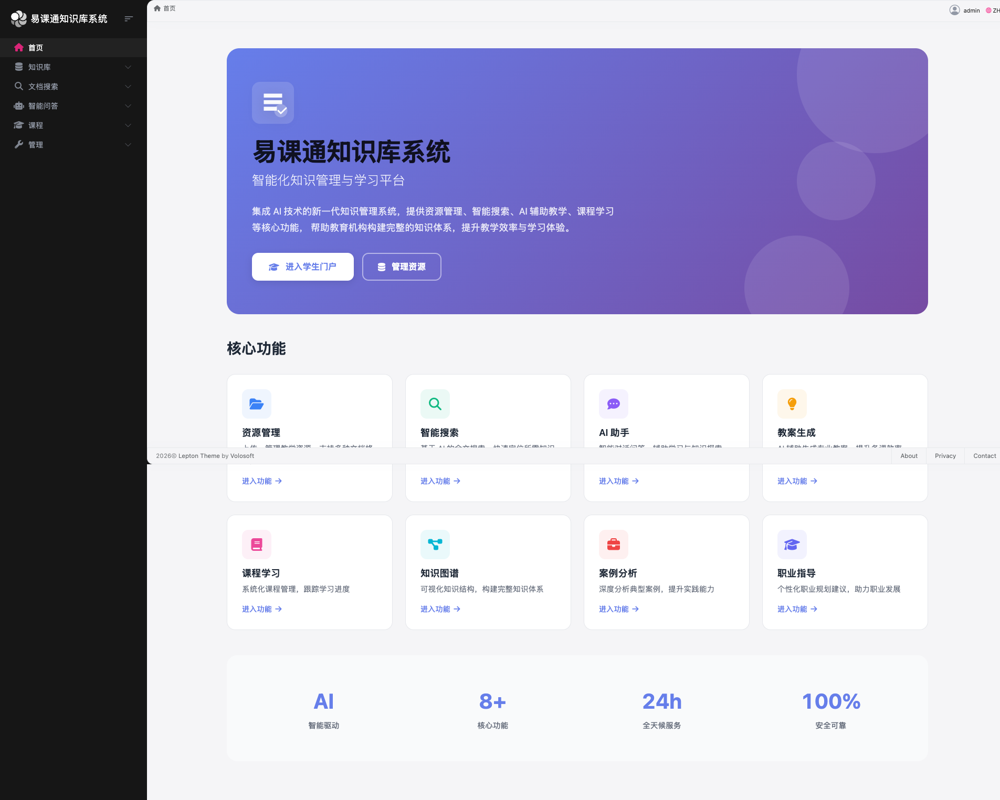

---

## 一、知识库管理

### 1.1 资源列表

知识库是系统的核心模块,用于管理各类教学资源。

**访问路径:** `/resources`

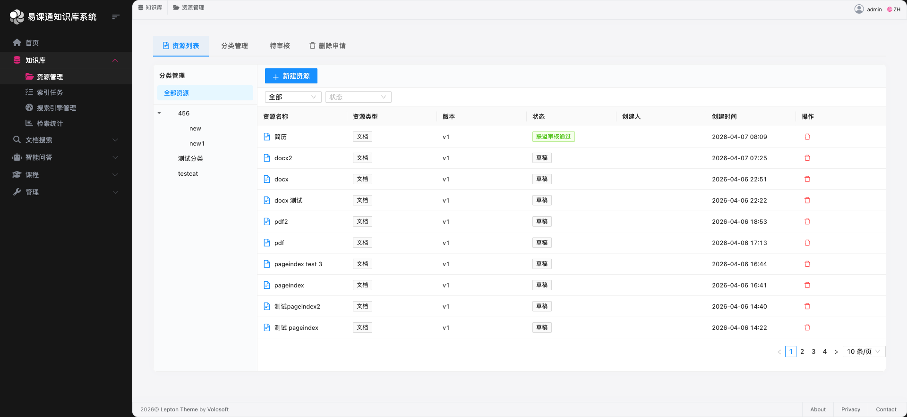

**支持的文件类型:**
- 文档: PDF、Word、PPT、Excel、TXT、Markdown
- 视频: MP4、MOV、AVI 等主流格式

**主要功能:**

| 功能 | 说明 |
|------|------|
| 分页浏览 | 每页显示资源列表,支持翻页导航 |
| 分类筛选 | 左侧树形分类导航,支持多级分类 |
| 时间筛选 | 支持按今天、昨天、近7天、近30天筛选 |
| 状态筛选 | 按资源状态(草稿、待审核、已通过等)筛选 |
| 搜索 | 按资源名称关键词搜索 |
| 收藏 | 收藏常用资源 |
| 下载 | 下载资源源文件 |
| 预览 | 在线预览文档内容或视频 |

**资源状态流程:**

```
草稿 → 待审核 → 学校审核通过 → 联盟审核通过
                ↓
              已拒绝/已隐藏
```

**操作说明:**
1. 点击资源名称可查看资源详情
2. 点击"上传新版"可更新资源版本
3. 点击"删除"可发起删除请求

### 1.2 待审核资源

管理端可审核下级提交的资源,支持学校和联盟两级审核。

**访问路径:** `/resources` → 切换到"待审核"标签

**审核操作:**
- **通过**: 资源进入下一级审核或正式发布
- **拒绝**: 填写拒绝原因,资源退回给提交者
- **查看**: 查看资源详情和审核历史

### 1.3 删除请求

管理端可审批资源删除请求。

**访问路径:** `/resources` → 切换到"删除请求"标签

**处理操作:**
- **批准**: 正式删除资源
- **拒绝**: 资源保留,删除请求关闭

### 1.4 资源版本管理

系统支持资源多版本管理。

**功能说明:**
- 每次上传新版本会创建新版本记录
- 可查看历史版本列表
- 可回滚到之前的版本
- 版本信息包括:版本号、上传时间、上传人

---

## 二、文档搜索

### 2.1 搜索功能概述

文档搜索是系统的核心能力之一,基于 Meilisearch 搜索引擎,提供快速、准确的文档检索服务。

**访问路径:** `/search`

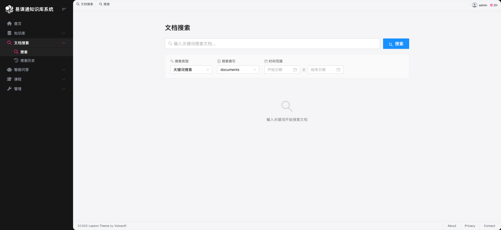

**搜索类型:**

| 搜索类型 | 说明 |
|----------|------|
| 关键词搜索 | 传统的关键词匹配搜索,适合精确查找 |
| 混合搜索 | 结合语义理解的搜索方式,能理解同义词和相关概念 |

**搜索索引:**

系统支持多个搜索索引,不同索引可能包含不同类型的资源或不同的搜索配置。默认使用 `documents` 索引。

**时间范围筛选:**

可指定搜索资源的时间范围:
- 开始日期: 选择搜索的起始日期
- 结束日期: 选择搜索的结束日期

### 2.2 搜索结果展示

搜索结果以卡片形式呈现,每个结果包含:

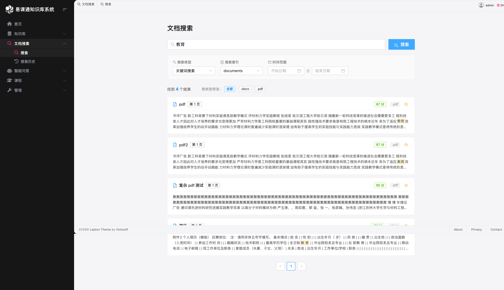

| 信息 | 说明 |
|------|------|
| 资源名称 | 文档或视频的名称 |
| 匹配位置 | 文档显示"第X页",视频显示时间范围 |
| 分类标签 | 资源所属的分类 |
| 相关度分数 | 0-100分,颜色表示:绿色(≥80)、蓝色(≥50)、橙色(≥30)、红色(<30) |
| 文件类型 | PDF、DOC、视频等标识 |
| 内容预览 | 包含搜索关键词的上下文内容 |

### 2.3 搜索结果筛选

在搜索结果页面可进一步筛选:

- **类型筛选**: 按文件扩展名(PDF、DOC、XLS等)或视频筛选
- **分页**: 每页显示20条结果,支持跳转指定页码

### 2.4 文档查看与视频播放

**文档查看:**
- 点击搜索结果直接跳转到文档查看器
- 自动定位到匹配的页面
- 保留了搜索上下文,返回时恢复搜索结果

**视频播放:**
- 视频结果点击后弹出播放窗口
- 自动跳转到匹配的时间点
- 显示该时间点的事件描述

### 2.5 查看资源评价

在搜索结果中可直接查看资源评价:

1. 点击评价图标(星星)
2. 弹出评价窗口,显示:
   - 平均评分(1-5星)
   - 评价总数
   - 评价分布柱状图
   - 评价详情列表

---

## 三、智能问答

### 3.1 AI文档问答

智能问答是基于AI大模型的知识库问答功能,允许用户针对具体文档提问,AI会基于文档内容给出准确答案。

**访问路径:** `/ai/chat`

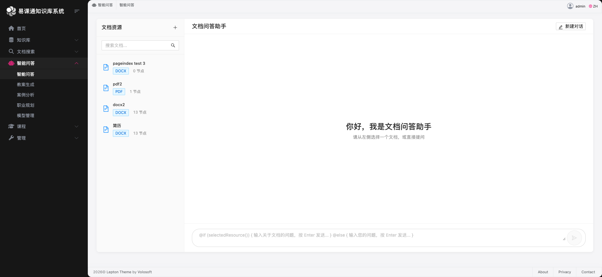

**功能特点:**

| 特性 | 说明 |
|------|------|
| 文档选择 | 左侧栏显示可问答的文档列表,支持搜索 |
| 实时对话 | AI流式返回回答,像聊天一样实时显示 |
| 多轮对话 | 支持上下文连续对话,AI会记住之前的问答 |
| Markdown支持 | AI回答支持Markdown格式,代码块、列表等 |

**操作步骤:**

1. **选择文档**: 在左侧文档列表中点击选择要问答的文档
2. **输入问题**: 在底部输入框输入问题,按Enter或点击发送
3. **查看回答**: AI基于文档内容实时返回回答
4. **继续追问**: 可以针对回答继续提问,AI会结合上下文回答

**使用场景:**

- 快速了解文档要点
- 查找文档中的特定信息
- 深入理解复杂概念

### 3.2 AI教案生成

AI教案生成可以根据教材内容和指定主题,自动生成完整的教学教案。

**访问路径:** `/ai/lesson-plan`

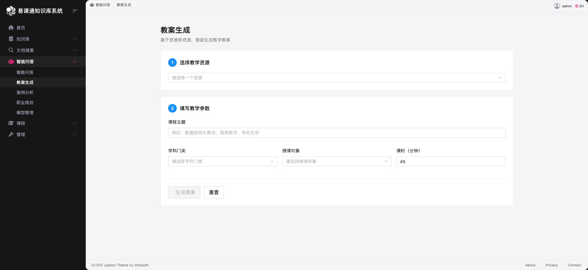

**功能说明:**
- 选择教材资源
- 输入教学主题
- 指定学科、年级、课时时长
- AI自动生成包含教学目标、过程、活动的完整教案
- 支持导出为Word文档

### 3.3 AI案例分析

AI案例分析可以针对教学案例进行深入分析,提取关键信息。

**访问路径:** `/ai/case-analysis`

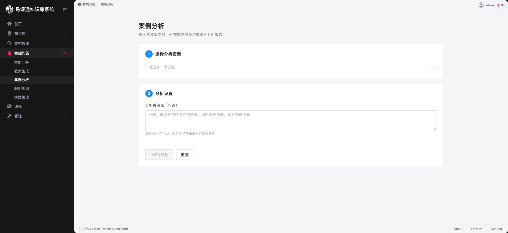

**功能说明:**
- 选择案例资源
- 指定分析重点(可选)
- AI自动分析案例背景、问题、解决方案等
- 支持导出分析报告

### 3.4 AI职业指导

AI职业指导功能为学生提供职业规划建议。

**访问路径:** `/ai/career-guidance`

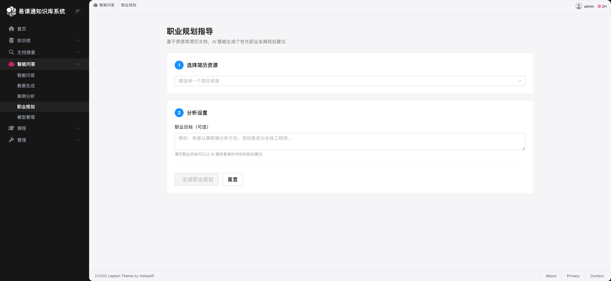

**功能说明:**
- 结合学生画像和职业目标
- 生成个性化的职业发展路径
- 推荐相关学习资源和技能要求

---

## 四、索引任务管理

### 4.1 索引任务监控

索引任务管理用于监控文档内容被AI理解和索引的进度。

**访问路径:** `/admin/indexing-jobs`

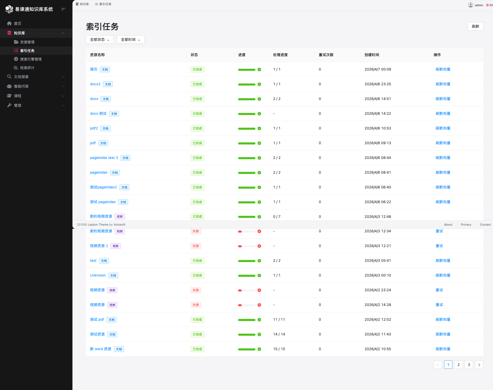

**任务状态说明:**

| 状态 | 说明 |
|------|------|
| Pending | 等待处理 |
| Parsing | 正在解析文档内容 |
| Indexing | 正在建立索引 |
| Completed | 已完成 |
| Failed | 失败 |
| Cancelled | 已取消 |

**监控信息:**

| 信息 | 说明 |
|------|------|
| 资源名称 | 被索引的文档名称 |
| 状态 | 当前处理状态 |
| 进度 | 处理进度百分比 |
| 处理详情 | 已处理页数/总页数 |
| 重试次数 | 失败重试次数 |
| 创建时间 | 任务创建时间 |
| 操作 | 刷新向量、重试、取消 |

**操作功能:**

- **刷新向量**: 重新计算文档的向量表示
- **重试**: 对失败任务进行重试
- **取消**: 取消等待中的任务

**筛选功能:**
- 按状态筛选
- 按时间范围筛选(全部、今天、昨天、近一周、近一月)

### 4.2 Meilisearch管理面板

Meilisearch管理面板提供搜索引擎的全面监控和管理。

**访问路径:** `/admin/meilisearch`

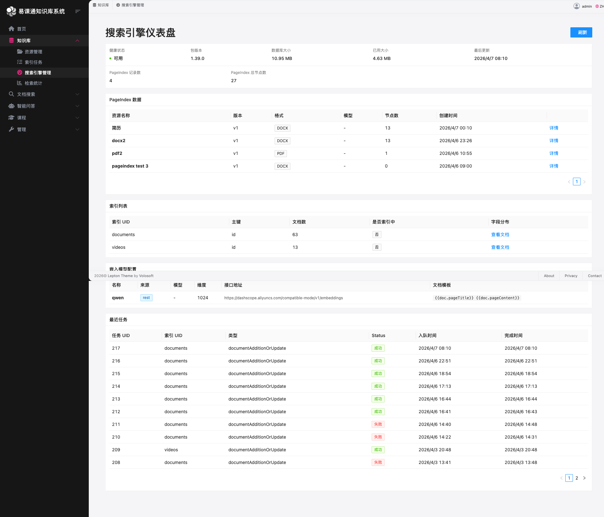

**系统状态监控:**

| 指标 | 说明 |
|------|------|
| 健康状态 | 搜索引擎是否正常运行 |
| 版本信息 | 当前运行的Meilisearch版本 |
| 数据库大小 | 已用空间/总空间 |
| 最后更新 | 最近一次索引更新的时间 |

**PageIndex数据:**

PageIndex是用于AI文档问答的索引数据,包含:

| 字段 | 说明 |
|------|------|
| 资源名称 | 文档名称 |
| 版本号 | 索引版本 |
| 格式 | 源文件格式 |
| 模型 | 使用的嵌入模型 |
| 节点数 | 索引的节点/段落数量 |
| 描述 | 文档描述信息 |

**索引管理:**

- 查看所有搜索索引
- 查看每个索引中的文档数量
- 查看索引状态(是否正在索引)
- 展开查看索引内的文档分组

**文档分组:**

文档按资源分组,每组显示:
- 资源名称和类型
- 页数/片段数
- 上传时间
- 详细内容预览

**嵌入器配置:**

查看配置的嵌入模型信息:
- 模型名称(如:text-embedding-3-small)
- 维度数
- 模板配置

**最近任务:**

查看搜索引擎最近执行的任务:
- 任务类型
- 状态
- 执行时间

---

## 五、搜索统计分析

### 5.1 搜索统计面板

搜索统计分析帮助管理员了解搜索使用情况。

**访问路径:** `/admin/search-statistics`

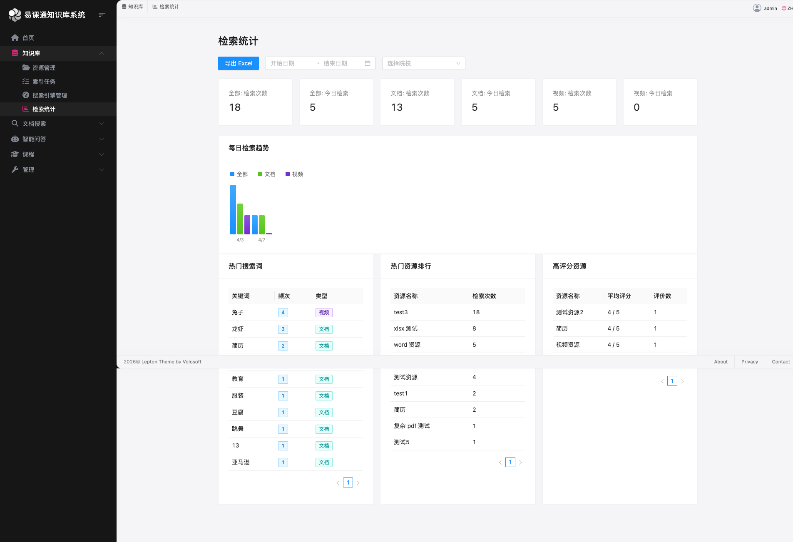

**统计维度:**

| 统计项 | 说明 |
|--------|------|
| 总搜索次数 | 所有用户的搜索总次数 |
| 今日搜索 | 今日搜索次数 |
| 活跃用户 | 使用搜索的总用户数 |
| 今日活跃用户 | 今日使用搜索的用户数 |
| 平均结果数 | 每次搜索返回的平均结果数 |

**分类统计:**
- 文档搜索统计
- 视频搜索统计
- 全部搜索统计

**趋势图表:**
- 每日搜索趋势折线图
- 热门搜索词排行
- 高点击资源排行
- 高评分资源排行

---

## 六、课程学习管理

### 6.1 课程列表

**访问路径:** `/learning/course-list`

查看所有课程资源,按分类浏览。

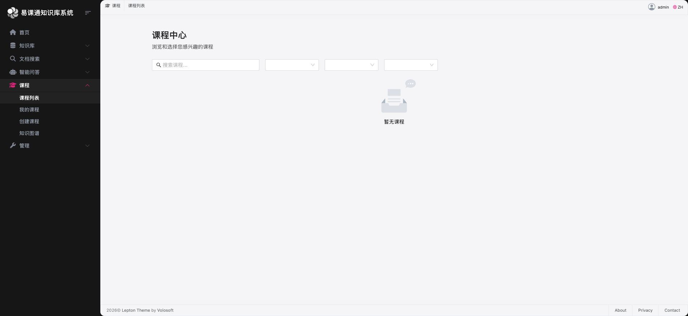

### 6.2 我的课程

**访问路径:** `/learning/my-courses`

教师可管理自己创建的课程。

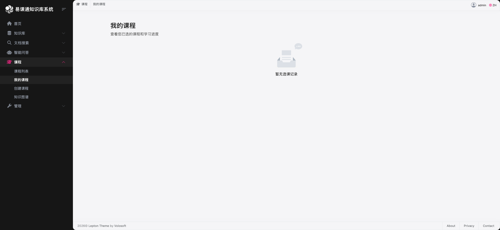

### 6.3 课程详情

**访问路径:** `/learning/course-detail/:id`

查看课程详细信息,包括课程内容、知识图谱、练习等。

### 6.4 知识图谱

**访问路径:** `/learning/knowledge-graph/:courseId`

以可视化图形展示课程知识点之间的关联。

### 6.5 练习管理

**访问路径:** `/learning/exercise/:courseId`

管理课程配套的练习题目。

---

## 七、联盟管理

### 7.1 联盟成员管理

**访问路径:** `/admin/alliance`

管理联盟内的成员学校和机构。

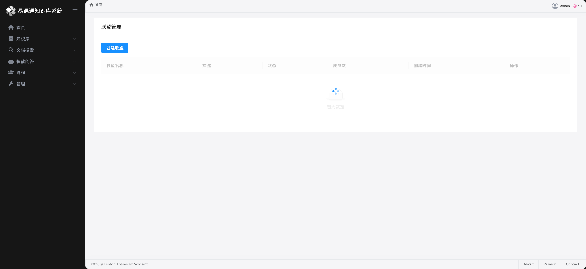

---

## 八、用户管理

### 8.1 用户列表

**访问路径:** `/identity/users`

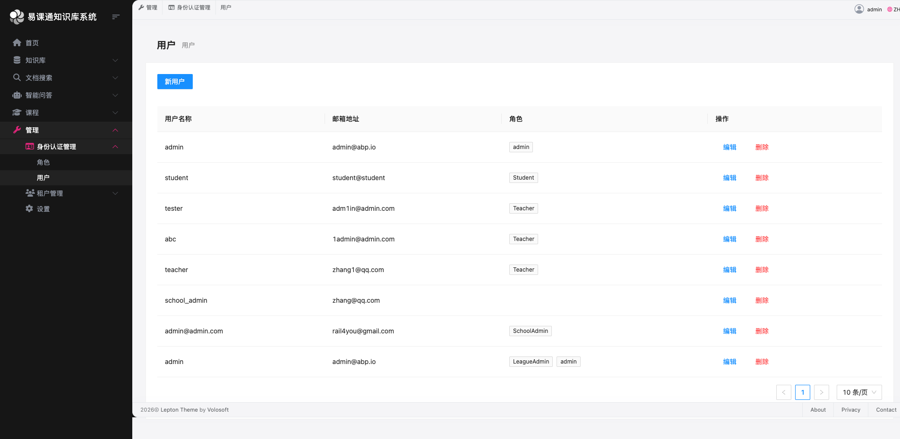

- 查看所有用户
- 创建、编辑、删除用户
- 分配角色和权限
- 批量导入用户(通过Excel)

### 8.2 角色管理

**访问路径:** `/identity/roles`

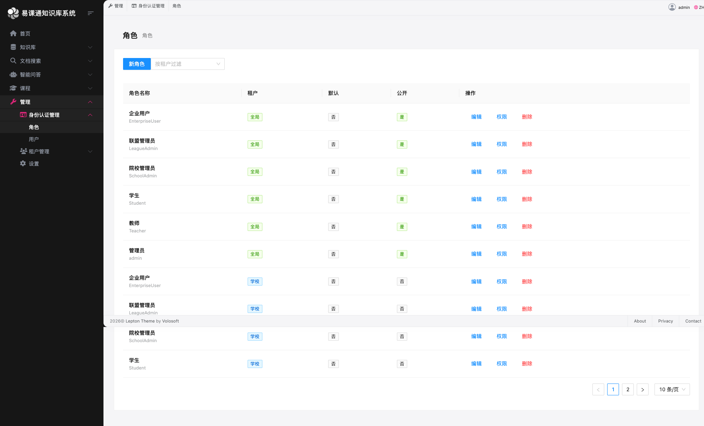

- 管理系统角色
- 配置角色权限

---

## 九、搜索技术说明

### 9.1 Meilisearch搜索能力

Meilisearch是一个高性能的搜索引擎,类似于Elasticsearch,但更轻量、易用。

**核心能力:**

| 能力 | 说明 |
|------|------|
| 快速响应 | 毫秒级搜索响应 |
| 相关度排序 | 根据关键词匹配程度打分,返回最相关结果 |
| 错别字容忍 | 支持一定程度的错别字和拼写错误 |
| 同义词支持 | 自动识别同义词进行搜索 |
| 过滤筛选 | 支持按分类、时间、文件类型等条件筛选 |
| 分页 | 支持大结果集的分页浏览 |

**搜索结果评分:**

搜索结果按相关度评分(0-100分):
- 绿色(≥80分): 高度相关
- 蓝色(≥50分): 较高相关
- 橙色(≥30分): 中等相关
- 红色(<30分): 较低相关

### 9.2 PageIndex智能问答

PageIndex是用于AI文档智能问答的专有索引技术。

**与普通搜索的区别:**

| 特性 | Meilisearch搜索 | PageIndex智能问答 |
|------|-----------------|-------------------|
| 用途 | 关键词查找文档 | 理解文档内容,回答问题 |
| 能力 | 匹配关键词 | 理解语义,提取答案 |
| 交互 | 用户自己找答案 | AI直接给出答案 |
| 技术 | 倒排索引+评分 | LLM大语言模型 |

**工作原理:**

1. 文档被分割成多个段落/节点
2. 每个节点被转换为"向量"(一种数字表示)
3. 用户提问时,问题也被转换为向量
4. 系统找到与问题最"接近"的文档节点
5. LLM大语言模型基于相关节点内容生成回答

**特点:**
- 可以理解文档的语义内容
- 能够回答关于文档内容的具体问题
- 支持多轮对话,记住上下文
- 回答会指明来源

**适用场景:**
- "这篇论文的主要观点是什么?"
- "这个教程的第三步怎么做?"
- "请总结这份合同的关键条款"

### 9.3 分页功能说明

搜索结果支持分页浏览:

**分页参数:**
- 每页显示20条结果
- 当前页码: pageIndex
- 支持跳转指定页面

**操作方式:**
1. 点击页码数字跳转到指定页
2. 点击"上一页/下一页"翻页
3. 输入页码后按Enter跳转

---

## 十、资源评价与推荐系统

### 10.1 资源评价系统

用户可以对资源进行评分和评论。

**评价功能:**

| 功能 | 说明 |
|------|------|
| 星级评分 | 1-5星评分 |
| 文字评论 | 可选,输入评价内容 |
| 修改评价 | 可修改自己的评价 |
| 删除评价 | 可删除自己的评价 |

**评价显示:**

资源详情页显示:
- 平均评分(1-5星)
- 评价总数
- 评分分布(各星级评价数量)
- 评价列表(用户名、评分、时间、内容)

**评价入口:**

- 在搜索结果页面点击星星图标
- 在资源详情页面评价区域
- 在学生门户资源卡片上评价

### 10.2 资源推荐系统

系统为用户提供个性化资源推荐。

**推荐类型:**

| 推荐类型 | 说明 |
|----------|------|
| 个性化推荐 | 基于用户历史行为和偏好推荐 |
| 热门推荐 | 当前最热门的资源 |
| 相关推荐 | 与当前浏览资源相似的内容 |
| 分类推荐 | 基于用户所在分类的推荐 |

**推荐维度:**

推荐结果综合考虑以下因素:
- 资源热度(浏览、收藏、下载次数)
- 用户偏好(历史浏览和收藏)
- 内容相似度
- 评分和评价
- 时效性

**应用场景:**

1. **学生门户首页**: "为你推荐"版块展示个性化资源
2. **资源详情页**: "相关资源"版块展示相似内容
3. **搜索结果**: 相关度高的资源排在前面

**推荐理由标签:**

系统会显示推荐原因,帮助用户理解推荐逻辑:
- "相似内容"
- "热门资源"
- "你收藏的分类"
- "同作者作品"等

---

## 十一、系统设置

### 11.1 租户管理

**访问路径:** `/tenant-management`

管理多租户/多学校环境。

### 11.2 系统设置

**访问路径:** `/setting-management`

配置系统各项参数。

---

## 附录:功能访问路径汇总

| 功能模块 | 访问路径 |
|----------|----------|
| 知识库 | /resources |
| 文档搜索 | /search |
| AI智能问答 | /ai/chat |
| AI教案生成 | /ai/lesson-plan |
| AI案例分析 | /ai/case-analysis |
| AI职业指导 | /ai/career-guidance |
| 索引任务 | /admin/indexing-jobs |
| Meilisearch管理 | /admin/meilisearch |
| 搜索统计 | /admin/search-statistics |
| 联盟管理 | /admin/alliance |
| 用户管理 | /identity/users |
| 角色管理 | /identity/roles |
| 课程列表 | /learning/course-list |
| 我的课程 | /learning/my-courses |
| 课程详情 | /learning/course-detail/:id |
| 知识图谱 | /learning/knowledge-graph/:courseId |
| 练习 | /learning/exercise/:courseId |
