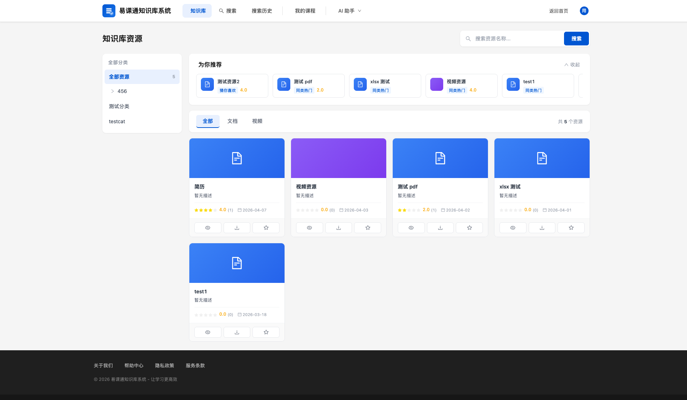
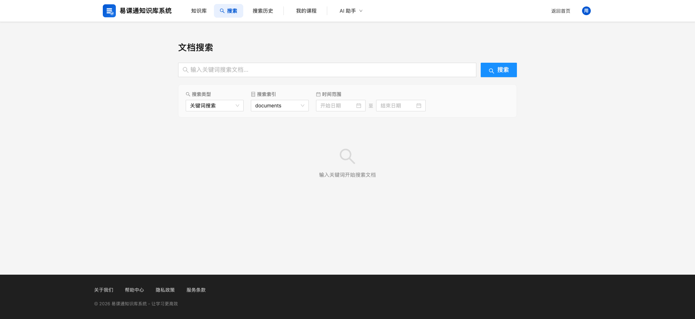
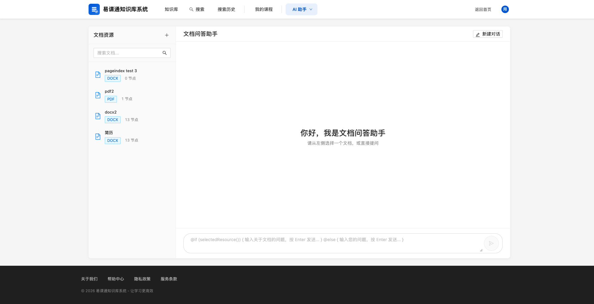
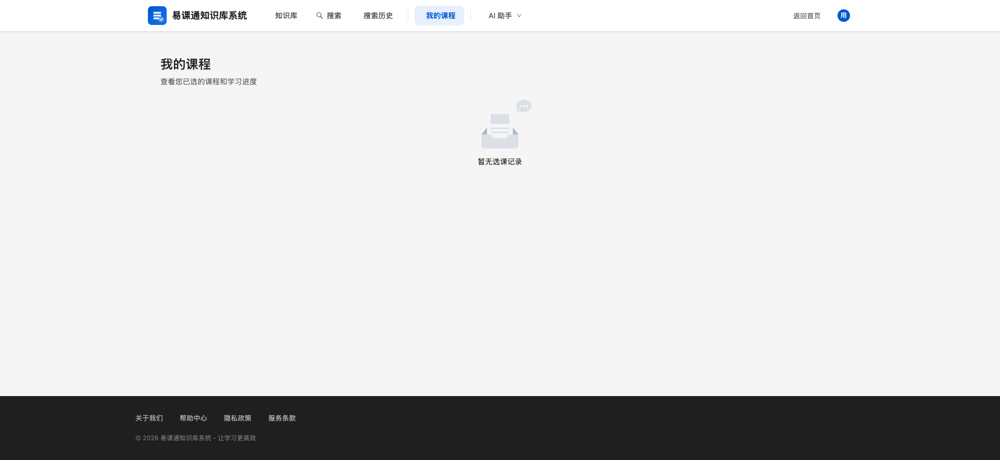
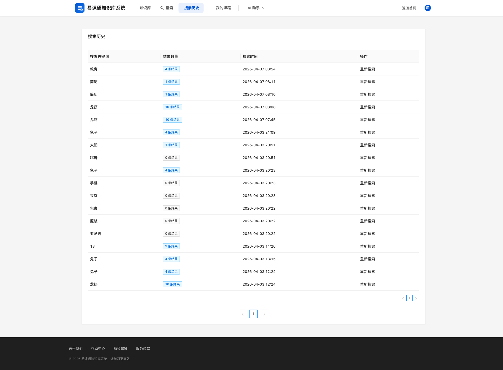
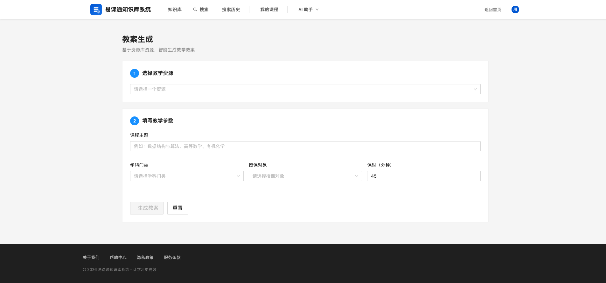
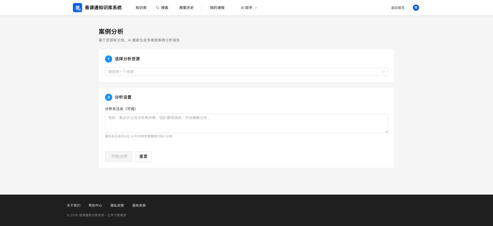
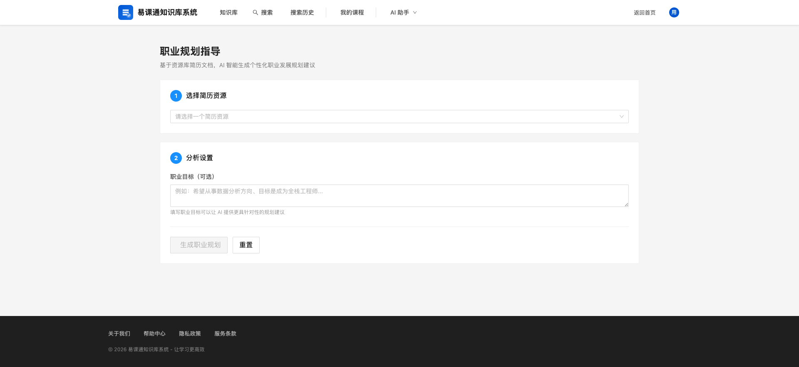

# 知识库管理系统学生端功能介绍

## 概述

知识库管理系统学生端是专门为学生用户设计的资源学习和探索平台。学生可以浏览、搜索、收藏学习资源,并使用AI智能问答功能深入理解学习内容。

---

## 一、学生资源门户

### 1.1 功能入口

**访问路径:** `/student/resources`

学生登录后自动进入资源门户首页。

### 1.2 资源浏览

学生门户展示已审核通过的优质学习资源。

**资源展示方式:**

| 展示形式 | 说明 |
|----------|------|
| 网格视图 | 资源以卡片网格形式展示 |
| 缩略图 | 每张卡片显示资源预览图 |
| 资源信息 | 名称、类型(文档/视频)、评分 |

**资源类型筛选:**

页面顶部提供资源类型筛选:

| 类型 | 说明 |
|------|------|
| 全部 | 显示所有资源 |
| 文档 | 仅显示PDF、Word、PPT等文档 |
| 视频 | 仅显示教学视频 |

### 1.3 分类导航

左侧边栏提供分类树形导航:

- 支持多级分类展开/折叠
- 点击分类名称筛选该分类下的资源
- 显示分类层级结构,方便快速定位

### 1.4 资源搜索

页面顶部提供搜索框:

**操作步骤:**
1. 输入资源名称关键词
2. 点击搜索或按Enter键
3. 查看搜索结果

### 1.5 为你推荐

页面顶部展示个性化推荐资源:

**推荐规则:**

系统综合考虑以下因素为学生推荐资源:
- 个人浏览历史和收藏偏好
- 当前热门资源
- 与已浏览资源相似的内容

**交互说明:**
- 推荐栏可折叠/展开
- 如果个性化推荐不可用,自动切换为热门推荐
- 每张推荐卡片显示:资源名称、推荐理由、评分

### 1.6 资源操作

每张资源卡片支持以下操作:

| 操作 | 说明 |
|------|------|
| 预览 | 在线预览文档或播放视频 |
| 下载 | 下载资源到本地 |
| 收藏 | 收藏资源到个人收藏夹 |

**收藏功能:**
- 点击收藏图标即可收藏
- 收藏成功后显示成功提示
- 收藏后可在个人收藏夹中快速访问

---

## 二、资源详情

### 2.1 打开详情

点击资源卡片打开详情侧边栏,显示完整信息:

| 信息项 | 说明 |
|--------|------|
| 资源名称 | 完整的资源标题 |
| 描述 | 资源详细说明 |
| 类型 | 文档或视频 |
| 分类 | 所属分类 |
| 文件大小 | 资源容量 |
| 上传时间 | 发布时间 |

### 2.2 资源预览

在详情页面可直接预览内容:

**文档预览:**
- 在线查看文档内容
- 支持PDF、Word等格式

**视频预览:**
- 内嵌视频播放器
- 可播放、暂停、调整音量

### 2.3 相关资源

详情页面底部展示相关推荐:

**推荐维度:**
- 相似内容:内容主题相似的资源
- 热门资源:当前热度较高的资源
- 同分类:同一分类下的其他资源

**交互:**
- 点击标签切换查看不同推荐类型的资源
- 点击资源卡片查看详情或直接操作

### 2.4 资源评价

在详情页面查看和发表评价:

**查看评价:**
- 显示平均评分(星级)
- 显示评价总数
- 显示各星级评价分布

**发表评价:**
- 选择评分(1-5星)
- 输入评价内容(可选)
- 点击提交

**我的评价:**
- 如果已评价,显示我的评分和内容
- 支持修改评价
- 支持删除评价

---

## 三、文档搜索

### 3.1 功能入口

学生可以使用文档搜索功能快速找到需要的学习资料。

**访问路径:** `/student/search`

**搜索能力说明:**

| 搜索类型 | 说明 |
|----------|------|
| 关键词搜索 | 输入关键词,快速匹配文档 |
| 混合搜索 | 结合语义理解,支持同义词和相关概念 |

**搜索索引:**

系统使用 Meilisearch 搜索引擎,能够:
- 毫秒级响应搜索
- 支持错别字容忍
- 自动识别同义词
- 按相关度排序结果

### 3.2 搜索筛选

**时间范围筛选:**
- 选择开始日期和结束日期
- 仅搜索该时间范围内的资源

**类型筛选:**
- 在结果区域按文件类型筛选
- 支持:全部、PDF、DOC、XLS、PPT等

### 3.3 搜索结果

**结果信息:**

每条搜索结果包含:
| 信息 | 说明 |
|------|------|
| 资源名称 | 文档或视频的名称 |
| 匹配位置 | 文档显示"第X页",视频显示时间范围 |
| 分类标签 | 资源所属分类 |
| 相关度分数 | 0-100分,颜色表示相关程度 |
| 内容预览 | 包含搜索词的上下文片段 |

**相关度评分说明:**

| 分数范围 | 颜色 | 说明 |
|----------|------|------|
| ≥80分 | 绿色 | 高度相关 |
| ≥50分 | 蓝色 | 较高相关 |
| ≥30分 | 橙色 | 中等相关 |
| <30分 | 红色 | 较低相关 |

### 3.4 查看资源

**文档查看:**
- 点击搜索结果跳转文档查看器
- 自动定位到匹配的页面
- 高亮显示搜索关键词

**视频播放:**
- 视频结果点击后弹出播放窗口
- 自动跳转到匹配的时间点
- 显示该时间点的视频内容描述

### 3.5 分页浏览

搜索结果支持分页:

- 每页显示20条结果
- 点击页码或使用翻页按钮浏览更多
- 支持跳转到指定页面

### 3.6 查看评价

在搜索结果中可直接查看资源评价:
- 点击评价图标(星星)
- 弹出评价窗口,查看评分和评价内容

---

## 四、AI智能问答

### 4.1 功能入口

学生可以使用AI智能问答功能,针对具体文档提问并获得准确答案。

**访问路径:** `/student/ai/chat`

### 4.2 文档选择

左侧栏显示可问答的文档列表:

- 列表展示文档名称和类型
- 支持搜索筛选文档
- 点击选择要问答的文档

### 4.3 智能对话

**对话特点:**

| 特性 | 说明 |
|------|------|
| 实时响应 | AI流式返回回答,像聊天一样即时显示 |
| 上下文记忆 | 支持多轮对话,AI记住之前的问答历史 |
| 文档理解 | AI基于选定的文档内容回答问题 |
| Markdown格式 | AI回答支持代码块、列表等格式 |

**使用方式:**

1. **选择文档**: 在左侧列表点击选择文档
2. **输入问题**: 在底部输入框输入问题
3. **发送**: 按Enter或点击发送按钮
4. **查看回答**: AI实时返回基于文档内容的回答
5. **继续追问**: 针对回答继续提问,AI结合上下文回答

### 4.4 适用场景

**学习理解:**
- "这篇课文的主要论点是什么?"
- "请解释这个概念的含义"
- "这个公式如何使用?"

**内容查找:**
- "文档中关于xxx的内容在哪里?"
- "第三步的具体操作是什么?"
- "请找出文档中的关键数据"

**复习总结:**
- "请总结这篇文档的要点"
- "这个章节有哪些重要概念?"
- "帮我整理这份笔记"

---

## 五、课程学习

### 5.1 我的课程

**访问路径:** `/student/courses`

查看学生已加入的课程。

### 5.2 课程详情

**访问路径:** `/student/courses/:id`

查看课程详细信息,包括:
- 课程介绍
- 课程目录
- 学习进度
- 相关资源

### 5.3 知识图谱

**访问路径:** `/learning/knowledge-graph/:courseId`

可视化展示课程知识点之间的关联:
- 以图形方式呈现知识点
- 显示知识点之间的逻辑关系
- 帮助理解课程结构

### 5.4 课程练习

**访问路径:** `/learning/exercise/:courseId`

完成课程配套练习题,巩固所学知识。

---

## 六、搜索历史

### 6.1 功能入口

查看个人的搜索历史记录。

**访问路径:** `/student/search-history`

### 6.2 历史记录

**记录信息:**

| 信息 | 说明 |
|------|------|
| 搜索词 | 之前搜索的关键词 |
| 时间 | 搜索时间 |
| 结果数 | 返回的结果数量 |

**操作:**
- 点击历史记录快速执行相同搜索
- 支持分页浏览历史

---

## 七、功能说明

### 7.1 资源类型支持

学生端支持以下资源类型:

| 类型 | 格式 | 预览 | 下载 |
|------|------|------|------|
| 文档 | PDF、Word、PPT、Excel、TXT | 支持 | 支持 |
| 视频 | MP4、MOV等 | 支持 | 支持 |

### 7.2 评分说明

资源评分采用5星制:

| 星级 | 说明 |
|------|------|
| 5星 | 非常优秀 |
| 4星 | 很好 |
| 3星 | 一般 |
| 2星 | 较差 |
| 1星 | 很差 |

评分会影响资源的推荐排序,高质量资源会获得更多推荐机会。

### 7.3 收藏夹说明

收藏功能帮助学生:
- 快速访问常用学习资源
- 整理个人学习资料库
- 方便复习时快速找到资源

---

## 附录:功能访问路径汇总

| 功能模块 | 访问路径 |
|----------|----------|
| 资源门户 | /student/resources |
| 文档搜索 | /student/search |
| 搜索历史 | /student/search-history |
| AI智能问答 | /student/ai/chat |
| AI教案助手 | /student/ai/lesson-plan |
| AI案例分析 | /student/ai/case-analysis |
| AI职业指导 | /student/ai/career-guidance |
| 我的课程 | /student/courses |

**AI 功能截图:**

| AI教案助手 | AI案例分析 | AI职业指导 |
|---|---|---|
|  |  |  |

---

## 常见问题

**Q: 为什么有些资源看不到?**
A: 学生端只显示经过审核通过的优质资源。部分资源可能还在审核中或被驳回。

**Q: 搜索没有结果怎么办?**
A: 尝试以下方法:
- 检查关键词拼写
- 使用更简短的关键词
- 尝试混合搜索模式
- 扩大时间筛选范围

**Q: AI问答回答不准确?**
A: AI的回答基于文档内容。如果回答不满意:
- 尝试换一种方式提问
- 检查是否选择了正确的文档
- 追问具体细节

**Q: 如何下载资源?**
A: 点击资源卡片的下载按钮,或在详情页面点击下载。下载可能需要一定时间,请耐心等待。

**Q: 收藏的资源在哪里查看?**
A: 目前收藏功能记录在服务器端,后续版本会在个人中心展示收藏夹。
