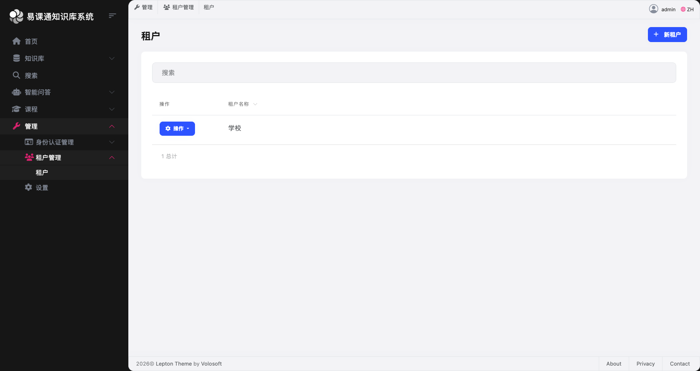
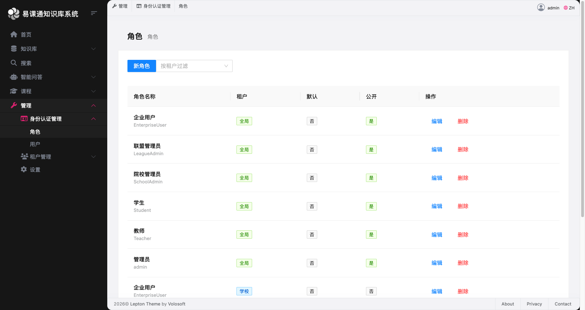
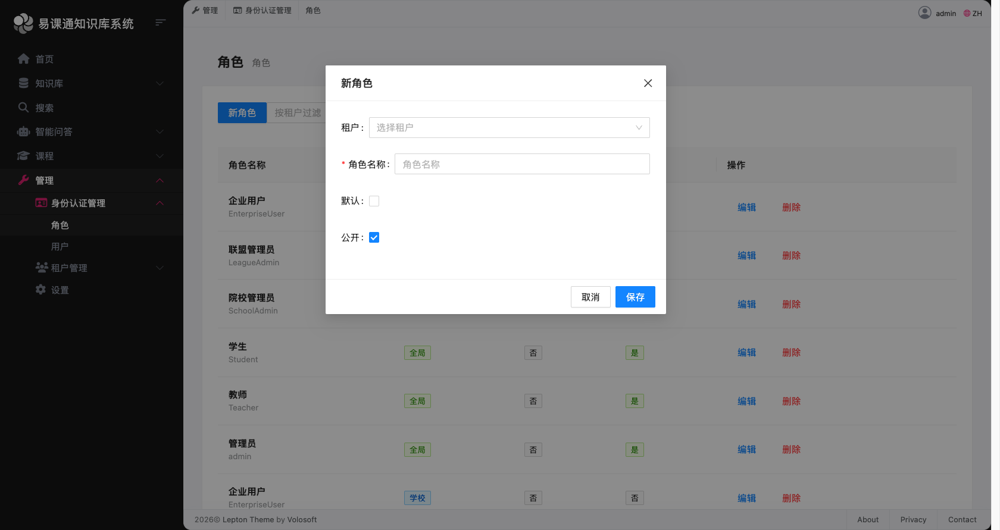
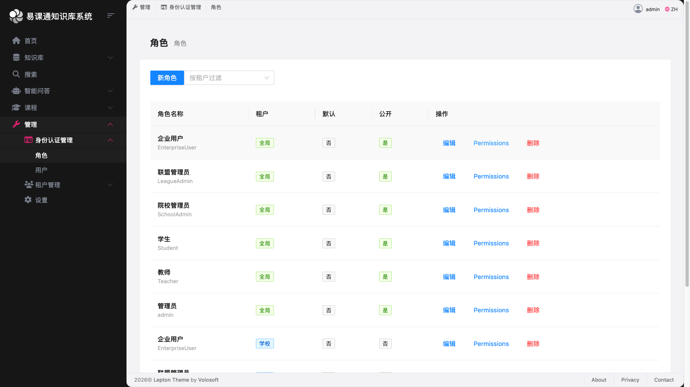
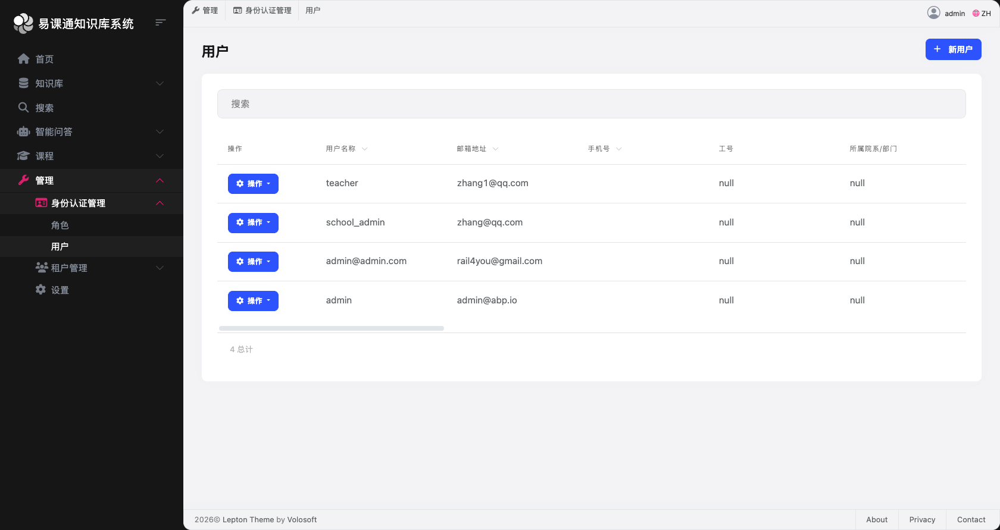

# 多校协同管理 - 管理员操作手册

## 一、概述

本手册指导管理员如何通过系统管理导航菜单完成多校协同管理的核心配置工作。通过本手册，您将学会：

- 创建和管理租户（院校/组织）
- 基于租户创建角色并分配权限
- 创建用户并关联角色

## 二、系统角色体系

本系统基于 RBAC（基于角色的访问控制）模型，支持以下 5 类角色：

| 角色名称 | 角色类型 | 说明 |
|---------|---------|------|
| 联盟管理员 | LeagueAdmin | 平台最高权限，可管理所有院校数据 |
| 院校管理员 | SchoolAdmin | 管理本校用户、资源和数据 |
| 教师 | Teacher | 管理课程、上传资源、查看学生数据 |
| 学生 | Student | 学习课程、使用资源、参与智能问答 |
| 企业用户 | EnterpriseUser | 参与校企合作、查看资源 |

## 三、管理操作流程

### 流程图

```
┌─────────────┐     ┌─────────────┐     ┌─────────────┐
│  1. 创建租户  │ ──▶ │ 2. 创建角色  │ ──▶ │ 3. 创建用户  │
│   (院校)     │     │  分配权限    │     │  关联角色    │
└─────────────┘     └─────────────┘     └─────────────┘
```

---

## 四、操作步骤详解

### 步骤一：创建租户（院校/组织）

**功能说明：** 租户代表一个独立的院校或组织，每个租户拥有独立的用户体系、资源和数据空间。

**操作路径：** 管理端 → 租户管理 → 租户



**操作步骤：**

1. 登录系统（使用联盟管理员账号）
2. 点击左侧导航菜单 **「管理端」**
3. 展开 **「租户管理」**，点击 **「租户」**
4. 点击右上角 **「新建租户」** 按钮
5. 填写租户信息：
   - **名称**：院校名称（如：北京大学、清华大学）
   - **管理员邮箱**：该租户管理员的邮箱地址
   - **管理员密码**：设置初始密码
6. 点击 **「保存」** 完成创建

**注意事项：**
- 租户名称一旦创建不可修改
- 管理员邮箱用于接收初始登录信息
- 建议使用院校正式名称，便于识别

---

### 步骤二：创建角色并分配权限

**功能说明：** 角色是权限的集合，通过角色可以批量管理用户的访问权限。

**操作路径：** 管理端 → 身份认证管理 → 角色



**操作步骤：**

#### 2.1 创建新角色



1. 点击左侧导航菜单 **「管理端」**
2. 展开 **「身份认证管理」**，点击 **「角色」**
3. 点击右上角 **「新角色」** 按钮
4. 填写角色信息：
   - **所属租户**：
     - 选择 **「全局」**：角色对所有租户生效（联盟级角色）
     - 选择 **「具体租户」**：角色仅对所选租户生效（院校级角色）
   - **角色名称**：输入角色名称（如：Teacher、SchoolAdmin）
   - **默认**：勾选后，新用户自动获得此角色
   - **公开**：勾选后，角色信息对所有用户可见
5. 点击 **「保存」** 完成创建

#### 2.2 分配权限



1. 在角色列表中，找到刚创建的角色
2. 点击 **「操作」** → **「权限」**
3. 在权限配置页面，勾选该角色需要的权限：
   - **知识库权限**：资源管理、资源审核、资源下载等
   - **用户管理权限**：创建用户、编辑用户、删除用户等
   - **课程管理权限**：创建课程、编辑课程、课程报名等
   - **搜索权限**：管理索引、查看统计等
4. 点击 **「保存」** 完成权限配置


**预设角色权限参考：**

**注意事项：**
- 权限调整后，用户刷新页面即可生效（无需等待24小时）
- 全局角色对所有租户生效，租户角色仅对当前租户生效
- 建议使用系统预设角色，避免权限配置错误

---

### 步骤三：创建用户并关联角色

**功能说明：** 创建用户账号并分配角色，用户即可登录系统并使用相应功能。

**操作路径：** 管理端 → 身份认证管理 → 用户



**操作步骤：**

#### 3.1 单个用户创建

1. 点击左侧导航菜单 **「管理端」**
2. 展开 **「身份认证管理」**，点击 **「用户」**
3. 点击右上角 **「新用户」** 按钮
4. 填写用户信息：
   - **所属租户**：
     - 选择 **「全局」**：用户为联盟级管理员
     - 选择 **「具体租户」**：用户属于所选院校
   - **用户名**：登录账号（唯一，不可重复）
   - **姓名**：用户真实姓名
   - **邮箱**：用户邮箱地址
   - **手机号**：用户手机号
   - **密码**：设置初始密码
   - **角色**：勾选需要分配的角色
5. 点击 **「保存」** 完成创建

#### 3.2 批量导入用户

1. 在用户列表页面，点击 **「导入」** 按钮
2. 下载 **Excel 导入模板**
3. 按模板格式填写用户信息：
   - 用户名、姓名、邮箱、手机号、角色、所属租户
4. 上传填写好的 Excel 文件
5. 系统自动验证并导入用户

**注意事项：**
- 用户名必须唯一
- 初始密码建议统一设置，并通知用户首次登录后修改
- 批量导入时，确保 Excel 格式正确，租户名称需与系统一致

---

## 五、常见场景示例

### 场景一：新增一所合作院校

**目标：** 为新合作的「XX大学」创建院校管理员和初始用户

**操作步骤：**

1. **创建租户**
   - 名称：XX大学
   - 管理员邮箱：admin@xx.edu.cn

2. **创建院校管理员角色**（如已存在可跳过）
   - 所属租户：XX大学
   - 角色名称：SchoolAdmin
   - 权限：用户管理、资源管理、数据查看

3. **创建院校管理员账号**
   - 所属租户：XX大学
   - 用户名：xx_admin
   - 角色：SchoolAdmin

4. **通知院校管理员**
   - 发送登录地址、账号和初始密码

---

### 场景二：为院校批量导入教师

**目标：** 为「XX大学」导入50名教师

**操作步骤：**

1. 下载用户导入模板
2. 填写50名教师信息：
   - 所属租户：XX大学
   - 角色：Teacher
3. 上传 Excel 文件
4. 系统自动创建50个教师账号
5. 导出账号列表，通知教师登录

---

## 六、数据权限说明

### 租户数据隔离

- **联盟管理员**：可查看和管理所有院校数据
- **院校管理员**：仅可查看和管理本校数据
- **教师/学生**：仅可查看和使用本校资源

### 权限生效机制

- 权限调整后，用户刷新页面即可生效
- 无需等待系统同步，实时生效

---

## 七、常见问题

### Q1：如何修改用户所属租户？

A：用户创建后不支持直接修改租户。如需调整，请删除原账号并重新创建。

### Q2：如何重置用户密码？

A：在用户列表中，点击「操作」→「重置密码」，输入新密码即可。

### Q3：角色权限配置错误怎么办？

A：在角色详情页面，重新勾选正确的权限并保存即可。

### Q4：批量导入失败怎么办？

A：请检查 Excel 格式是否正确，特别是租户名称需与系统完全一致。可查看导入日志定位具体错误。

---

## 八、技术支持

如有问题，请联系系统管理员或查阅技术文档。

**文档版本：** v1.0
**更新日期：** 2026-03-26
