# 资源库问题汇总

基于项目 `KnowledgeHub` 对 Excel 文件 `资源库问题汇总.xlsx` 中的测试反馈进行整理，输出为便于研发、测试和产品协作的 Markdown 文档。

## 文档说明

- 项目路径：`/Users/bai/projects/KnowledgeHub`
- 原始来源：`/Users/bai/Desktop/资源库问题汇总.xlsx`
- 测试时间：表内标记为 `5.19` 测试
- 问题总数：`28`
- 分组统计：
  - 管理账户：`14`
  - 教师及学校管理员账号：`6`
  - 学生账号：`8`
- 编号规则：
  - `M-*` 表示管理账户问题
  - `T-*` 表示教师及学校管理员账号问题
  - `S-*` 表示学生账号问题
- 状态标记：
  - `✅ 已修复` — 代码已修改并提交
  - `🔧 处理中` — 正在修复
  - `⏳ 待处理` — 尚未开始
- 说明：
  - 部分原始反馈只有一句简写，本文结合截图补充为更完整的问题描述。
  - 个别条目存在“Excel 中模块名”和“截图实际页面”不完全一致的情况，正文里已单独说明。
  - 管理账户最后一条在 Excel 原表中未填写序号，本文补编号为 `M-14`。

## 目录

- [一、管理账户问题](#一管理账户问题)
- [二、教师及学校管理员账号问题](#二教师及学校管理员账号问题)
- [三、学生账号问题](#三学生账号问题)

## 一、管理账户问题

### 本组索引

- [M-01 资讯分类"编码"字段含义不明确](#m-01-资讯分类编码字段含义不明确) ✅
- [M-02 资讯封面要求填写链接但前台没有展示闭环](#m-02-资讯封面要求填写链接但前台没有展示闭环) ⏳
- [M-03 微专业与实训入口建议从课程模块中独立](#m-03-微专业与实训入口建议从课程模块中独立) ⏳
- [M-04 知识图谱节点无法展开且缺少拖拽/滚轮交互](#m-04-知识图谱节点无法展开且缺少拖拽滚轮交互) ✅
- [M-05 新建实训项目弹窗为空，无法添加实训](#m-05-新建实训项目弹窗为空无法添加实训) ✅
- [M-06 多处弹窗右上角关闭按钮无效](#m-06-多处弹窗右上角关闭按钮无效) ✅
- [M-07 多选题选项数量固定为 A-D，无法扩展到 E](#m-07-多选题选项数量固定为-a-d无法扩展到-e) ✅
- [M-08 资讯内容维护缺少批量录入能力，逐条填写效率低](#m-08-资讯内容维护缺少批量录入能力逐条填写效率低) ⏳
- [M-09 企业档案更新后缺少结果查看入口或回显说明](#m-09-企业档案更新后缺少结果查看入口或回显说明) ✅
- [M-10 我的简历页面无法新增简历](#m-10-我的简历页面无法新增简历) ✅
- [M-11 岗位大厅/岗位管理无法新增岗位](#m-11-岗位大厅岗位管理无法新增岗位) ✅
- [M-12 企业档案缺少批量导入入口](#m-12-企业档案缺少批量导入入口) ⏳
- [M-13 退出登录后页面状态异常](#m-13-退出登录后页面状态异常) ✅
- [M-14 个人资料中的角色类型可手动修改，权限边界不清](#m-14-个人资料中的角色类型可手动修改权限边界不清) ✅

### M-01 资讯分类“编码”字段含义不明确

- 来源模块：资源库 > 资讯管理 > 资讯分类管理
- 原始反馈：`编码是什么意思`
- 问题说明：新建分类弹窗里存在“编码”字段，但界面没有解释它的业务含义、填写规则、是否必填，以及它与分类名称、排序、前台展示之间的关系。对业务人员来说，这更像内部技术字段，容易造成不知道该填什么、填错是否会影响系统的困惑。
- 影响：增加分类时存在理解成本，容易产生错误录入，也会让非技术用户误以为系统要求输入"程序编码"或其他内部标识。
- **修复方案**：保存分类时自动根据名称生成唯一编码（名称转小写 + 时间戳），前端弹窗不再显示"编码"字段，用户无需理解该技术字段含义。（提交: `06ed0b3`）
- 截图：

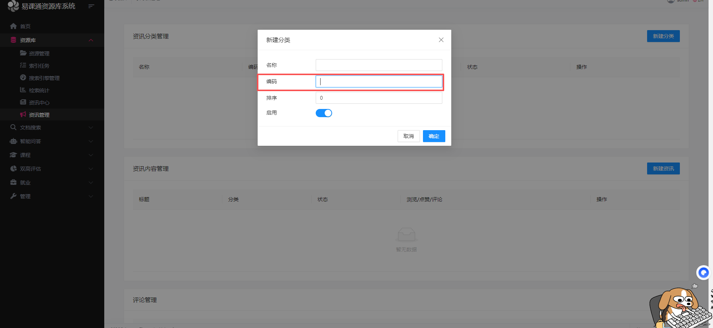

### M-02 资讯封面要求填写链接但前台没有展示闭环

- 来源模块：资源库 > 资讯管理 > 新建资讯
- 原始反馈：`为什么封面是上传链接？输入链接之后好像也没有地方显示`
- 问题说明：资讯编辑表单中提供的是“封面链接”输入项，而不是直观的上传控件。当前交互没有告诉用户链接应当来自哪里、是否支持本地上传，也没有体现封面在前台或详情页的展示位置，导致用户无法形成“上传/填写 -> 保存 -> 展示”的完整预期。
- 影响：内容运营人员难以正确维护资讯封面，封面字段很可能被空置、乱填或变成无效链接。
- 截图：

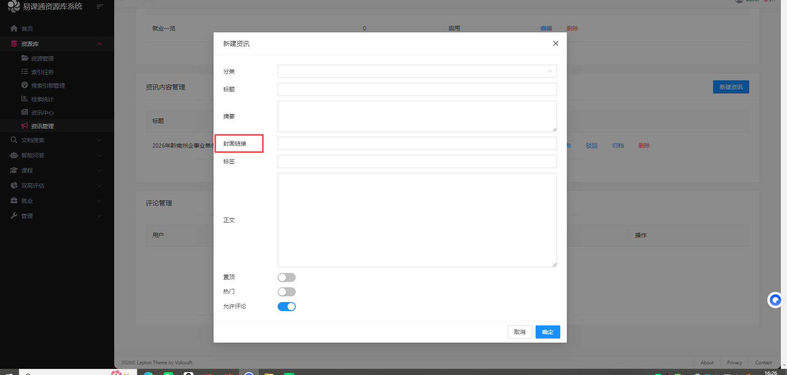

### M-03 微专业与实训入口建议从课程模块中独立

- 来源模块：课程
- 原始反馈：`微专业和实训可以分别单独放一个模块`
- 问题说明：当前左侧导航把微专业、实训项目、实训管理等能力都放在“课程”菜单下。对于业务侧来说，这些能力已经具备相对独立的业务目标和操作对象，继续挂在课程下面会让菜单层级显得拥挤，也不利于用户快速理解系统信息架构。
- 影响：导航认知成本高，用户需要在课程模块中反复展开查找；后续功能继续增加时，课程菜单会进一步膨胀。
- 截图：

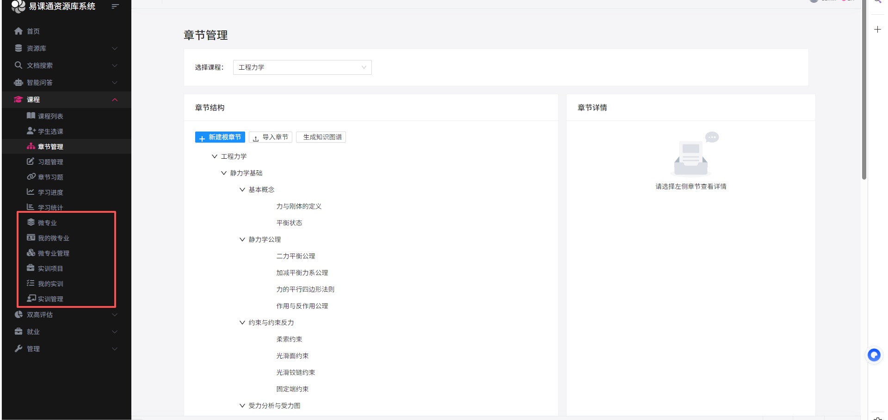

### M-04 知识图谱节点无法展开且缺少拖拽/滚轮交互 ✅

- 来源模块：课程 > 章节管理 > 知识图谱
- 原始反馈：`点击加号无法展开知识点，同时也不支持拖拽，滑动鼠标滚轮也没用`
- 问题说明：知识图谱页面顶部提示"单击节点可展开或收起子节点，支持拖拽画布和滚轮缩放"，但实际截图中被标出的 `+` 节点无法展开，画布交互也没有按提示生效。这说明界面文案和真实行为不一致，功能处于不可用或半可用状态。
- 影响：用户无法浏览课程知识结构，也无法验证知识图谱是否生成正确，核心可视化能力基本不可用。
- **修复方案**：后端 `GetDetailAsync` 添加 `BuildChapterTree` 方法构建层级章节数据（基于 ParentId 组装 children 树），ECharts tree 图获得正确的层级数据后节点展开和拖拽/缩放功能恢复正常。（提交: `be68070`）
- 截图：

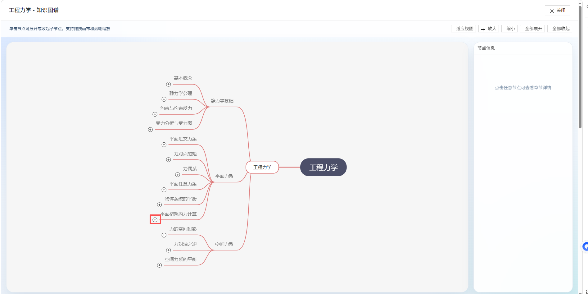

### M-05 新建实训项目弹窗为空，无法添加实训 ✅

- 来源模块：课程 > 实训管理
- 原始反馈：`无法添加实训`
- 问题说明：点击"新建实训项目"后虽然弹出了弹窗，但弹窗主体为空白，没有任何表单字段或操作提示，导致新建流程无法继续。问题不只是"保存失败"，而是入口打开后就没有可操作内容。
- 影响：管理员无法录入新的实训项目，相关业务无法开展。
- **修复方案**：ng-zorro-antd 21 要求弹窗内容通过 `<ng-container *nzModalContent>` 指令投影。已为实训管理的 3 个弹窗添加该指令包装。（提交: `ec1db99`）
- 截图：

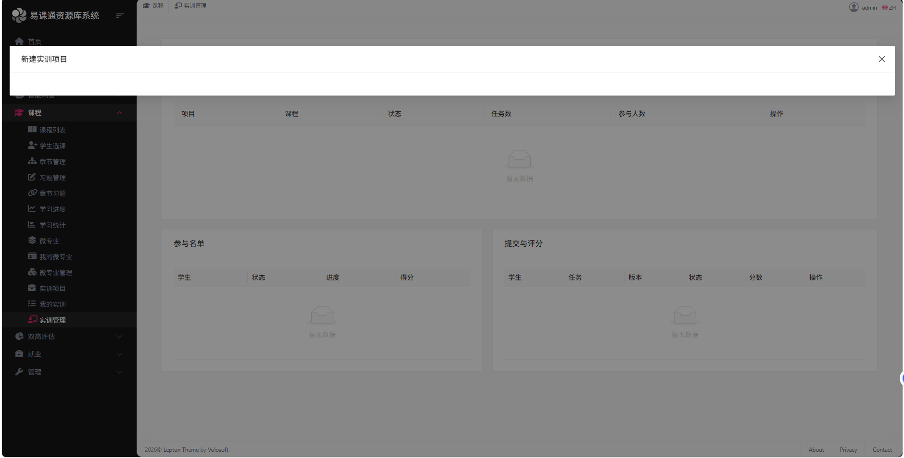

### M-06 多处弹窗右上角关闭按钮无效 ✅

- 来源模块：多处弹窗场景
- 原始反馈：`点进x号无反应，好几处都存在这个问题，请排查`
- 问题说明：截图显示弹窗右上角的关闭图标被明确标出，但点击后没有关闭效果。考虑到反馈中提到"好几处都存在"，这更像是统一弹窗组件、遮罩层事件或按钮绑定存在共性问题，而不是单一页面问题。
- 影响：用户在误触或不想继续编辑时无法快速退出弹窗，只能依赖其他路径关闭页面，严重影响基本交互体验。
- **修复方案**：为 5 个缺失 `(nzOnCancel)` 的 `<nz-modal>` 添加关闭事件处理。涉及实训管理 3 个弹窗、学生实训时间线弹窗、双高佐证材料弹窗。（提交: `04a2fc8`）
- 截图：

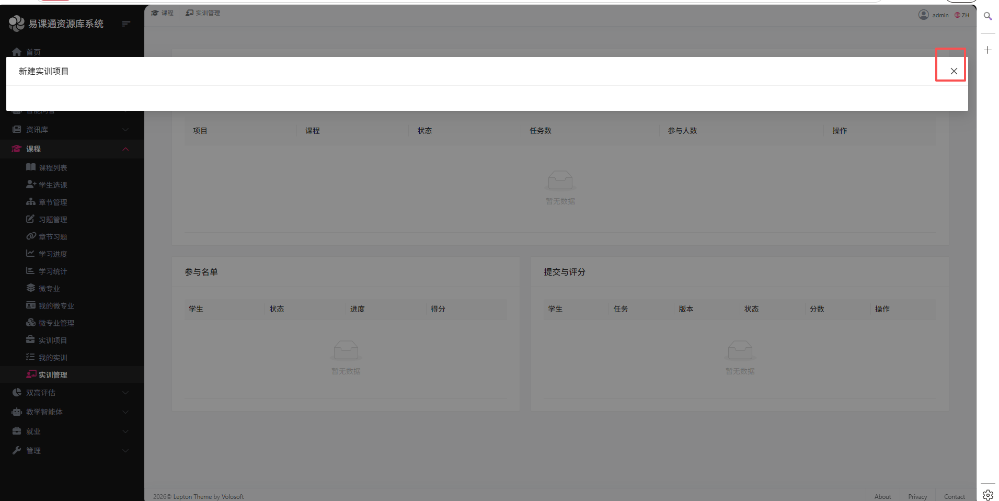

### M-07 多选题选项数量固定为 A-D，无法扩展到 E ✅

- 来源模块：课程 > 习题管理
- 原始反馈：`多选题可以增加一个E项`
- 问题说明：新建多选题界面当前只支持 `A`、`B`、`C`、`D` 四个选项，对应的正确答案也只能勾选四项。对于需要五选一、五选多或更复杂题型的课程场景，现有表单能力不够用。
- 影响：题库模型过于刚性，教师在导入或手工维护真实试题时会受到限制。
- **修复方案**：前端选项从固定 4 字段改为动态数组（2-10 个），支持添加/删除选项，自动映射 A-Z 字母标签。（提交: `9d91d4d`）
- 截图：

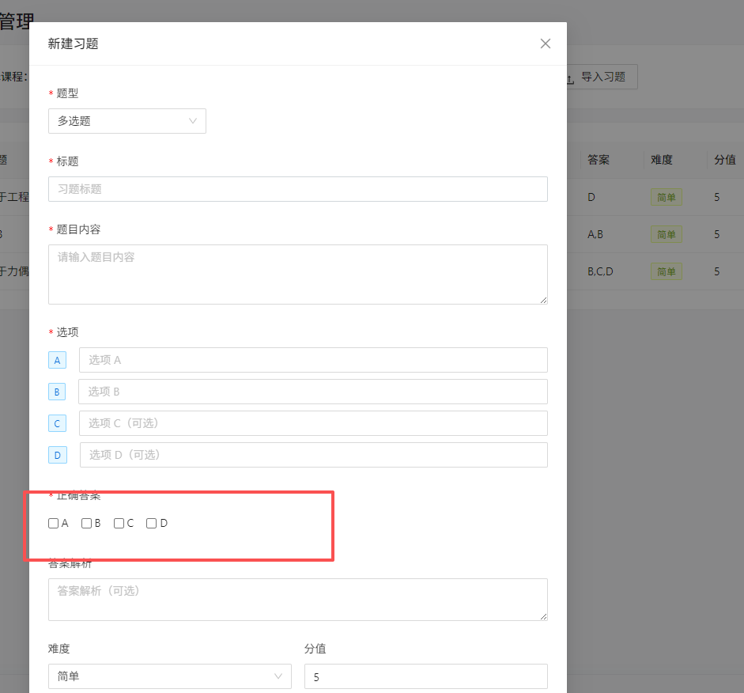

### M-08 资讯内容维护缺少批量录入能力，逐条填写效率低

- 来源模块：Excel 原表写为“咨询”，截图实际位于资源库 > 资讯管理 > 资讯内容
- 原始反馈：`咨询都要一条一条填写是不是效率太低了`
- 问题说明：原始反馈强调的是录入效率问题。结合截图可判断，当前资讯内容维护主要依赖“新建资讯”逐条新增，页面上没有看到批量导入、批量发布、批量复制等提效入口。对于需要集中录入大量资讯/咨询内容的场景，这种维护方式成本较高。
- 影响：内容运营效率低，批量建库或历史内容迁移的工作量大。
- 截图：

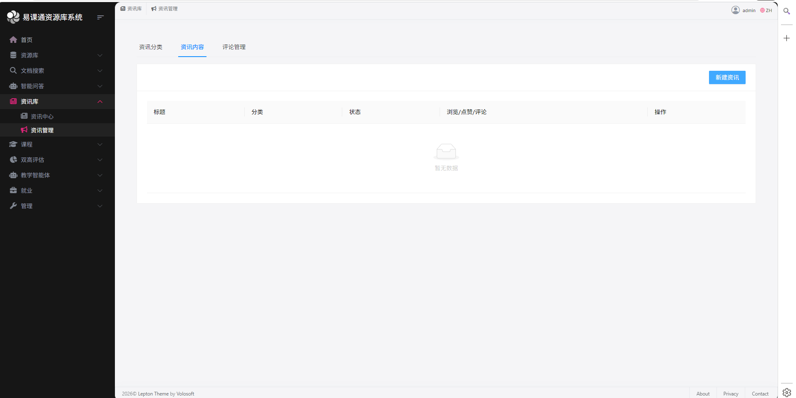

### M-09 企业档案更新后缺少结果查看入口或回显说明 ✅

- 来源模块：就业 > 企业档案
- 原始反馈：`企业档案更新后的数据去哪看？`
- 问题说明：截图中保存后出现"企业档案已更新"的成功提示，但页面仍停留在编辑表单，没有提供明确的查看结果入口、回到列表入口，或者更新前后差异的可见反馈。用户无法直观确认"刚刚改的内容是否已生效、会在哪里被其他角色看到"。
- 影响：保存操作的结果感弱，容易让用户怀疑数据没有真正落库，或者不知道后续如何核验。
- **修复方案**：保存成功后自动导航回岗位列表页；在编辑表单旁新增"返回"按钮，用户可随时离开。（提交: `6631d48`）
- 截图：

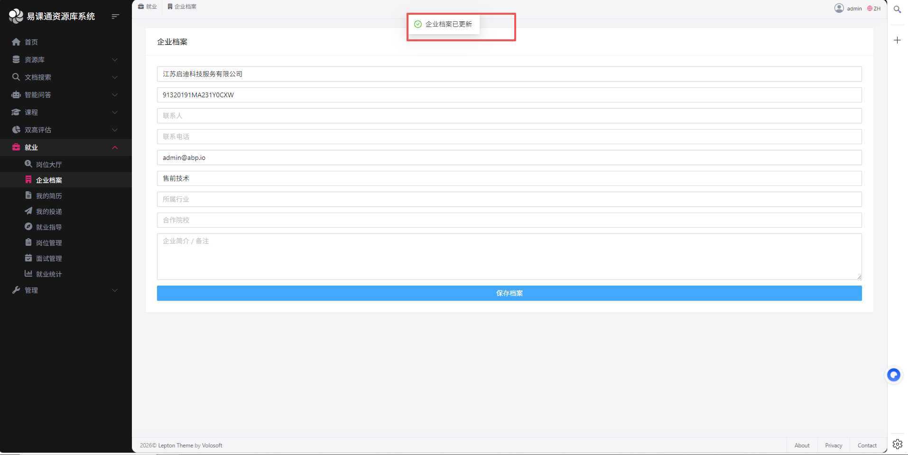

### M-10 我的简历页面无法新增简历 ✅

- 来源模块：就业 > 我的简历
- 原始反馈：`无法新增简历`
- 问题说明：页面右上角存在"新增简历"按钮，但原始反馈指出新增流程不可用。结合该组其他问题看，就业模块中的新增类流程可能存在统一的表单打开、提交或权限校验问题，需要和岗位新增、企业档案维护一起联查。
- 影响：学生或管理端用户无法建立简历记录，直接影响投递、就业指导等后续链路。
- **修复方案**：与 M-05 同根因，ng-zorro 21 弹窗内容需 `*nzModalContent` 投影。已添加指令包装。（提交: `6631d48`）
- 截图：

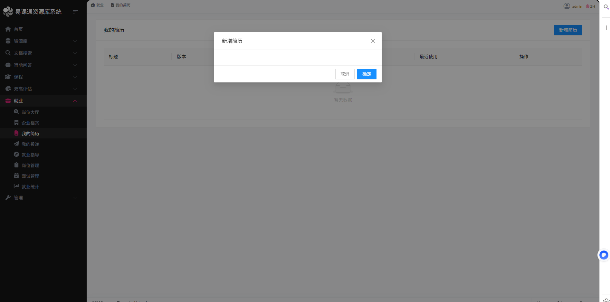

### M-11 岗位大厅/岗位管理无法新增岗位 ✅

- 来源模块：就业
- 原始反馈：`无法新增岗位`
- 问题说明：截图展示的是一个确认类弹窗，但用户反馈为"无法新增岗位"，说明新增岗位的入口可能触发了错误弹窗、空白弹窗、错误校验或保存失败流程，最终未能完成岗位创建。问题本质是就业模块中的岗位建档流程不可用。
- 影响：岗位信息无法沉淀到系统，招聘发布和学生投递链路都会被阻断。
- **修复方案**：与 M-05 同根因，ng-zorro 21 弹窗内容需 `*nzModalContent` 投影。已添加指令包装。（提交: `6631d48`）
- 截图：

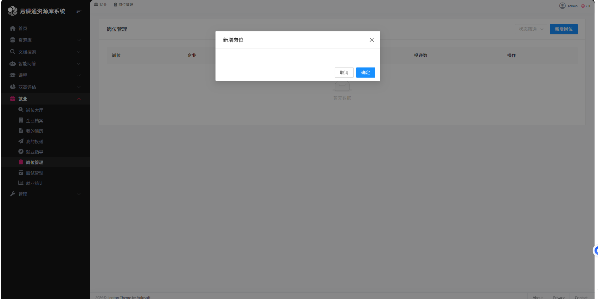

### M-12 企业档案缺少批量导入入口

- 来源模块：就业 > 企业档案
- 原始反馈：`能不能增加个批量导入功能`
- 问题说明：企业档案当前是标准表单式维护，适合单条录入，但对企业名录初始化、批量更新、院校导入合作企业等场景不够友好。页面上没有看到 Excel/CSV 导入等入口，意味着数据只能依赖人工逐条新增。
- 影响：企业档案建设效率低，不适合有较大基础数据量的院校落地使用。
- 截图：

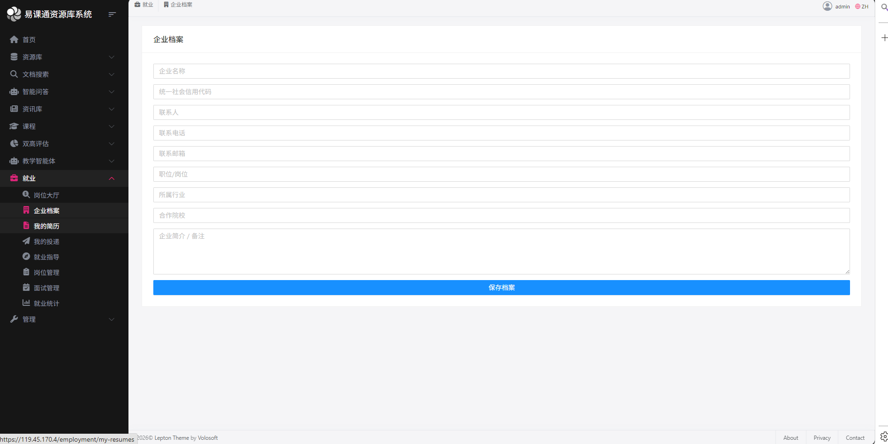

### M-13 退出登录后页面状态异常

- 来源模块：登录/退出流程
- 原始反馈：`退出账号之后会变成这样`
- 问题说明：截图中右上角同时出现了用户信息和“登录”入口，页面仍停留在系统首页，状态呈现不一致。正常退出后应清晰回到游客态，或者完整跳转到登录页；当前现象说明前端会话状态、页面渲染状态和登录入口控制没有完全同步。
- 影响：用户难以判断自己是否真的退出成功，也容易引发权限残留、刷新后状态突变等问题。
- **修复方案**：退出登录后使用 `window.location.href = '/'` 替代 `router.navigate(['/'])` 进行完整页面刷新，确保 ABP 框架缓存的布局状态（LeptonX header 用户信息等）被完全清除。修复 home.component.ts 和 student-layout.component.ts 两处。（提交: `06ed0b3`）
- 截图：

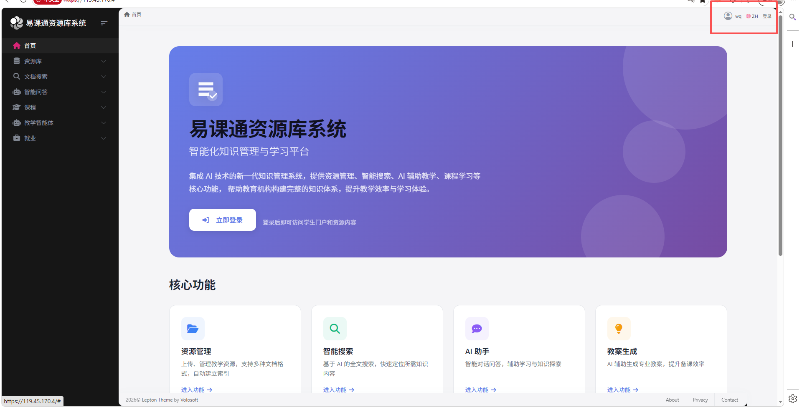

### M-14 个人资料中的角色类型可手动修改，权限边界不清 ✅

- 来源模块：个人资料
- 原始反馈：`个人资料部分的角色类型可以自己设置？那权限是不是也会随之变动？`
- 问题说明：截图显示个人资料页提供了"角色类型"下拉框。对业务用户来说，这会自然产生一个疑问：如果我能在个人资料里改角色类型，系统权限是否也会随之变化？角色应该是后台授权结果，不应在个人资料中以"自助可编辑字段"的形式出现，至少需要明确它只是展示字段还是受控字段。
- 影响：容易引发权限边界误解；如果前后端处理不严，还可能带来真实的权限风险。
- 备注：此条在 Excel 原表中未填写序号，本文补编号为 `M-14`。
- **修复方案**：为 `TenantUserAppService` 添加类级别 `[Authorize(Users.Default)]` 和方法级别 `[Authorize(Users.Create/Edit/Delete)]` 授权特性，防止未授权用户修改角色。同时为所有方法添加租户归属校验 `CheckTenantOwnership()`。（提交: `45f329e`）
- 截图：

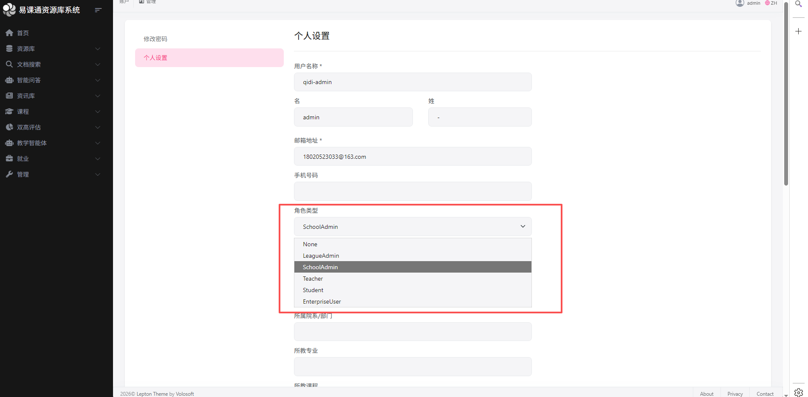

## 二、教师及学校管理员账号问题

### 本组索引

- [T-01 学校管理员可审核需联盟审核的资源](#t-01-学校管理员可审核需联盟审核的资源) ✅
- [T-02 学校管理员新增资讯分类失败](#t-02-学校管理员新增资讯分类失败) ✅
- [T-03 资讯保存失败](#t-03-资讯保存失败) ✅
- [T-04 资讯分类保存失败，接口校验信息直接暴露](#t-04-资讯分类保存失败接口校验信息直接暴露) ✅
- [T-05 课堂任务学生交互页显示"未知学生"](#t-05-课堂任务学生交互页显示未知学生) ✅
- [T-06 租户隔离异常：启迪管理员可看到 guozhou 用户](#t-06-租户隔离异常启迪管理员可看到-guozhou-用户) ✅

### T-01 学校管理员可审核需联盟审核的资源 ✅

- 来源模块：资源库 > 资源管理 > 待审核
- 原始反馈：`学校管理员也可以通过需要联盟审核的文件，这不太对吧`
- 问题说明：截图中有资源处于"需要联盟审核"状态，但学校管理员账号仍然可以看到并进入审核操作。按照业务语义，这类资源应当由更高一级的联盟角色处理，不应该下放给学校管理员。
- 影响：审核权责边界被打破，容易出现越权审批、流程失真和审计责任不清的问题。
- **修复方案**：`GetPendingAuditListAsync` 根据当前用户的 `SchoolAudit`/`LeagueAudit` 权限动态过滤：仅有校级权限只看 `PendingReview`，仅有联盟权限只看 `SchoolApproved`，两者都有则都看。（提交: `45f329e`）
- 截图：

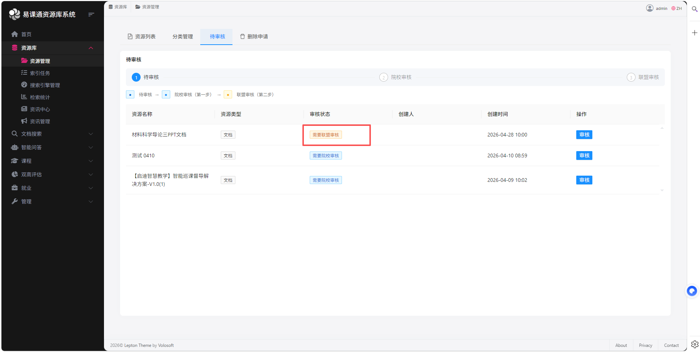

### T-02 学校管理员新增资讯分类失败 ✅

- 来源模块：资源库 > 资讯管理 > 资讯分类管理
- 原始反馈：`使用学校管理员新建分类失败`
- 问题说明：学校管理员在"新建分类"弹窗填写信息后，系统顶部直接提示"分类保存失败"。从界面看不出是权限不足、字段校验失败还是接口异常，用户拿不到有效修正信息。
- 影响：学校管理员无法自行维护资讯分类，功能名义上开放，实际不可用。
- **修复方案**：SchoolAdmin 角色缺少 News 权限。在 `IdentityDataSeederContributor` 中为 SchoolAdmin 添加 News.Create/Edit/Delete/Review/Publish 权限，为 Teacher 添加 News.Create/Edit 权限。（提交: `04a2fc8`）
- 截图：

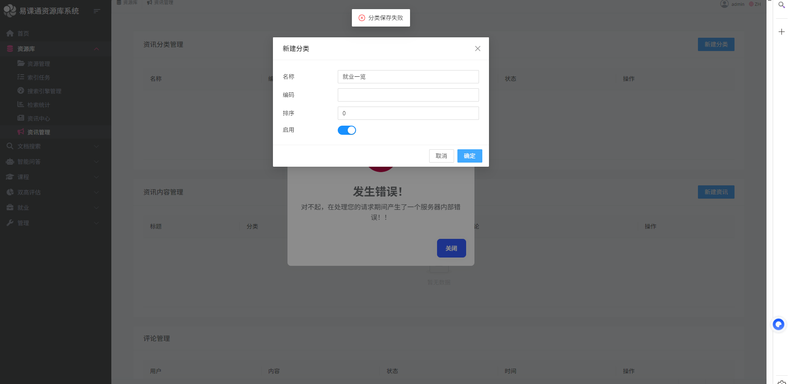

### T-03 资讯保存失败 ✅

- 来源模块：Excel 原表写为"咨询"，截图实际位于资源库 > 资讯管理
- 原始反馈：`咨询保存失败`
- 问题说明：从截图看，用户在资讯管理页面执行保存类操作后触发了系统错误弹窗，说明新增或编辑资讯内容的保存链路异常。由于弹窗没有给出业务层原因，无法区分是缺少分类、字段映射错误，还是权限/接口处理问题。
- 影响：教师或学校管理员无法完成资讯内容维护，后台内容建设受阻。
- **修复方案**：同 T-02，SchoolAdmin/Teacher 缺少 News 权限导致 403 错误。已添加权限。（提交: `04a2fc8`）
- 截图：

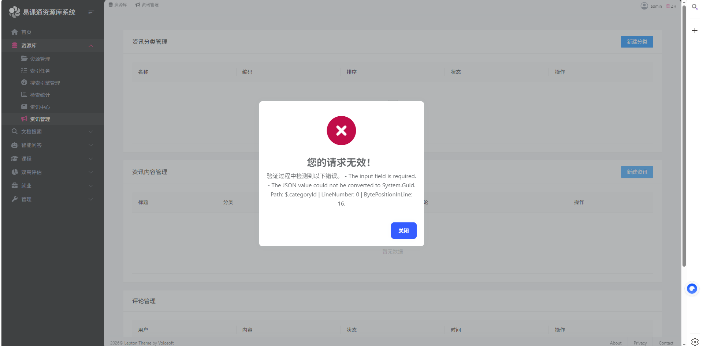

### T-04 资讯分类保存失败，接口校验信息直接暴露 ✅

- 来源模块：Excel 原表写为"咨询分类"，截图实际位于资源库 > 资讯管理
- 原始反馈：`咨询分类保存失败`
- 问题说明：截图中的错误弹窗不仅提示"请求无效"，还直接暴露了后端校验/反序列化细节，例如 `categoryId`、`System.Guid` 等技术信息。这说明前端没有对接口异常做用户态封装，后端返回的底层错误被原样展示到了页面上。
- 影响：用户看不懂问题原因，系统也暴露了不必要的内部实现细节，既影响体验，也不利于生产环境信息收敛。
- **修复方案**：前端错误处理改为提取 ABP 后端返回的 `error.error.message` 友好消息，不再展示技术细节；后端 DTO 添加 `[Required]` 校验属性提供更友好的校验提示。（提交: `04a2fc8`）
- 截图：

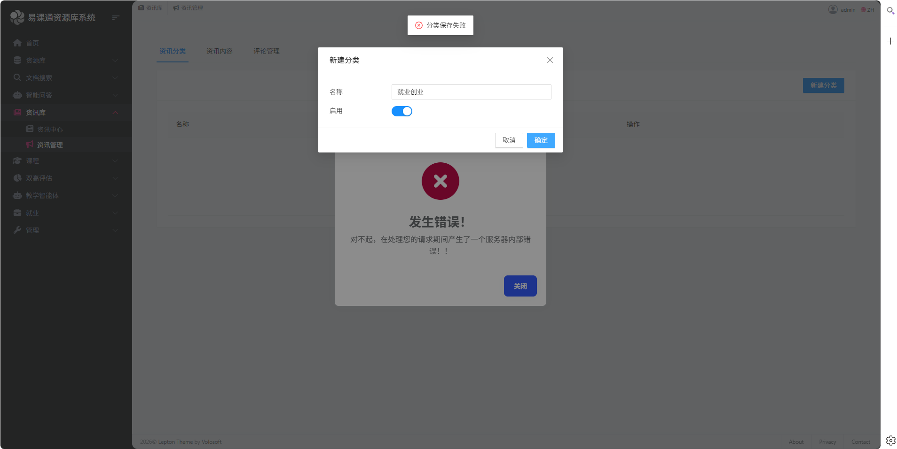

### T-05 课堂任务学生交互页显示"未知学生" ✅

- 来源模块：教学智能体 > 课堂任务
- 原始反馈：`显示未知学生`
- 问题说明：课堂任务的"学生交互"页中，学生卡片标题直接显示为"未知学生"，说明学生身份信息没有被正确关联或回填。页面同时还能看到最近活跃时间等记录，说明任务数据本身存在，但用户资料映射丢失了。
- 影响：教师无法确认是哪位学生参与了互动，课堂跟踪与教学评价失去意义。
- **修复方案**：`GetUserNamesAsync` 中 `x.Name ?? x.UserName` 未处理空字符串情况（Name 为 `""` 而非 null），改为 `!string.IsNullOrEmpty(x.Name) ? x.Name : x.UserName`。修复 3 个教学智能体服务文件。（提交: `9d91d4d`）
- 截图：

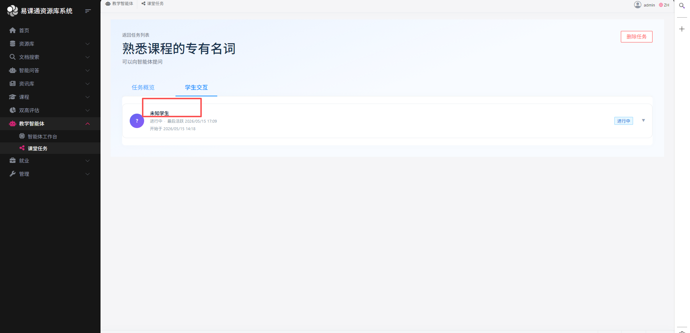

### T-06 租户隔离异常：启迪管理员可看到 guozhou 用户 ✅

- 来源模块：管理 > 身份认证管理 > 用户
- 原始反馈：`使用启迪管理员为什么可以看到guozhou的用户`
- 问题说明：截图中列表已筛选到租户 `guozhou`，并成功显示了该租户的用户数据。若当前登录人属于另一个租户的学校管理员，这意味着租户隔离没有按预期生效，至少列表访问范围超出了本租户边界。
- 影响：这是典型的数据越权问题，涉及跨租户用户信息泄露，优先级应当按高风险权限问题处理。
- **修复方案**：`GetListAsync` 对非 Host 用户强制限制为本租户，忽略客户端传入的 `TenantId`；`GetAsync`/`UpdateAsync`/`DeleteAsync` 等方法新增 `CheckTenantOwnership()` 校验；`CreateUserForTenantAsync` 对非 Host 用户强制覆盖 `input.TenantId`。（提交: `45f329e`）
- 截图：

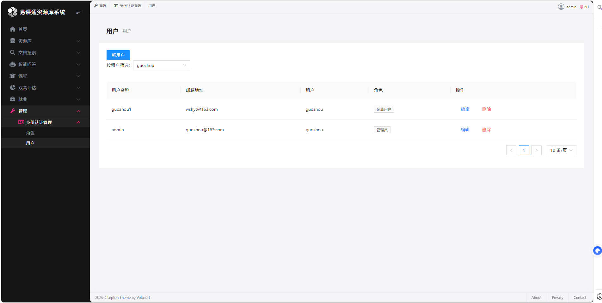

## 三、学生账号问题

### 本组索引

- [S-01 学生账号看不到二期功能模块](#s-01-学生账号看不到二期功能模块) ⏳
- [S-02 推荐资源点击无响应](#s-02-推荐资源点击无响应) ✅
- [S-03 学生端看到了草稿状态资源](#s-03-学生端看到了草稿状态资源) ✅
- [S-04 文档预览失败](#s-04-文档预览失败) ✅
- [S-05 资源下载失败](#s-05-资源下载失败) ✅
- [S-06 习题页只显示章节列表，题目内容未渲染](#s-06-习题页只显示章节列表题目内容未渲染) ✅
- [S-07 知识图谱/思维导图区域未正常显示内容](#s-07-知识图谱思维导图区域未正常显示内容) ✅
- [S-08 学生端不同页面界面风格不统一](#s-08-学生端不同页面界面风格不统一) ⏳

### S-01 学生账号看不到二期功能模块

- 来源模块：学生门户首页/资源库门户
- 原始反馈：`学生账号没有看见二期功能相关的模块，比如微专业`
- 问题说明：从截图看，学生侧顶部导航只有资源库、收藏、搜索、我的课程、AI 助手等入口，没有看到二期新增能力对应的模块入口，例如微专业、实训等。这说明二期功能要么没有向学生开放，要么导航配置没有同步到学生端。
- 影响：学生无法访问本应提供给他们的二期能力，造成功能“做了但看不见”的落地问题。
- 截图：

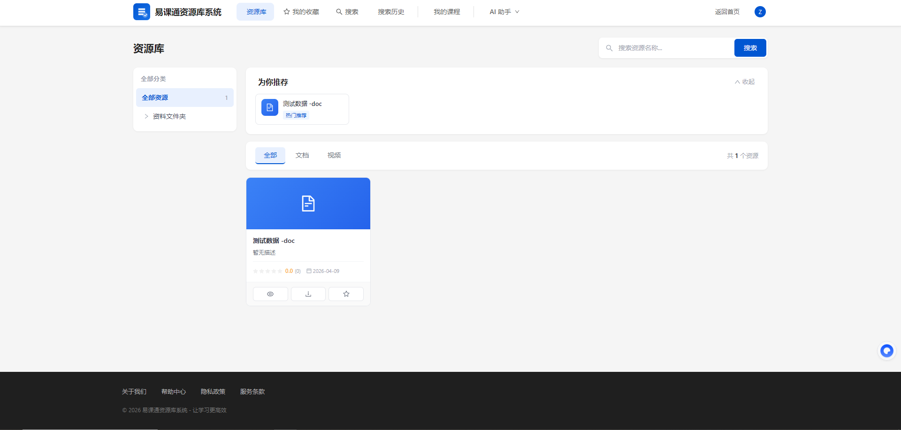

### S-02 推荐资源点击无响应

- 来源模块：学生资源库首页
- 原始反馈：`推荐文件但是点击无反应`
- 问题说明：截图中“为你推荐”区域有资源卡片被重点标出，用户预期点击后应进入资源详情、预览或下载流程，但实际没有任何响应。这说明推荐卡片与详情页之间的跳转链路没有打通，或者点击区域绑定不正确。
- 影响：推荐区失去导流作用，学生无法从首页直接消费推荐内容。
- **修复方案**：`selectRelatedResource` 方法缺少 `drawerVisible.set(true)` 调用，导致点击推荐卡片时资源详情抽屉不会打开。已添加该调用，与 `selectResource` 方法行为保持一致。（提交: `06ed0b3`）
- 截图：

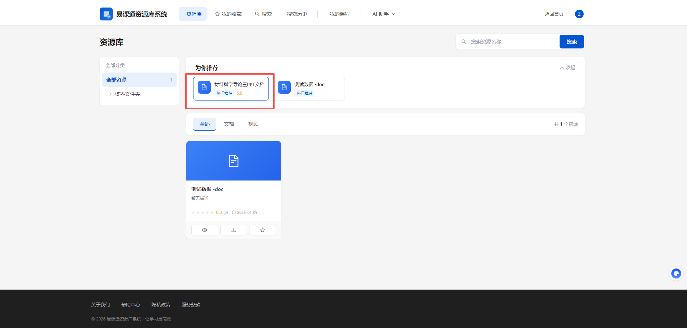

### S-03 学生端看到了草稿状态资源 ✅

- 来源模块：资源库 > 资源管理
- 原始反馈：`学生端是不是不应该看见草稿`
- 问题说明：截图中资源列表明确显示了多条"草稿"状态资源。如果这是学生账号可见页面，那么说明前台资源过滤条件没有区分发布态和草稿态，学生能够看到本不应对外开放的未发布内容。
- 影响：存在内容越权曝光风险，也会让学生看到未完成、不准确或待审核的资源。
- **修复方案**：`SearchAsync` 移除 `Draft` 状态，仅返回 `SchoolApproved` 和 `LeagueApproved`；`GetCollectedListAsync` 增加已审批状态过滤并修复分页计数不准确问题。（提交: `ec1db99`）
- 截图：

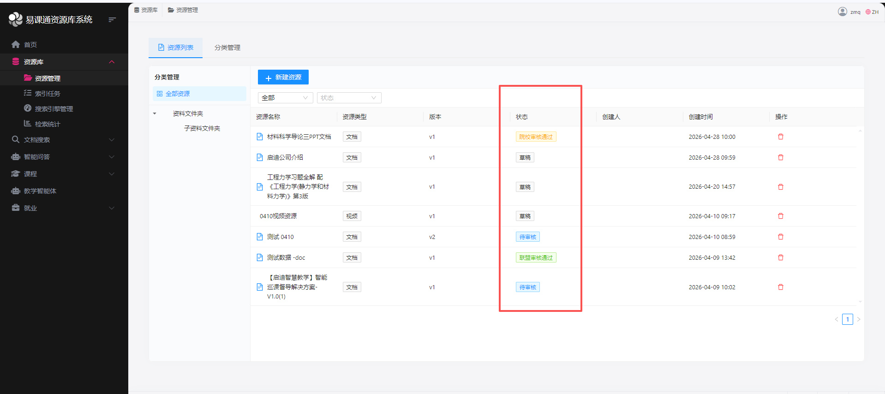

### S-04 文档预览失败 ✅

- 来源模块：学生资源库 > 文档预览
- 原始反馈：`预览失败`
- 问题说明：学生打开 `学生端手册.docx` 后，预览弹窗直接提示"预览加载失败，请稍后重试"，但下载按钮仍然存在。说明资源实体已找到，失败点更可能出在预览转换、预览服务接口或文件流读取阶段。
- 影响：学生无法在线预览资源，文档使用体验明显下降。
- **修复方案**：新增 `ResourceFileController` 提供正确的文件流预览端点 `GET /api/resource-file/{id}/preview`（返回 FileStreamResult），前端改用 `HttpClient` + `responseType: 'arraybuffer'` 加载文件，替代原来通过 JSON 序列化 byte[] 的方式。（提交: `ec1db99`）
- 截图：

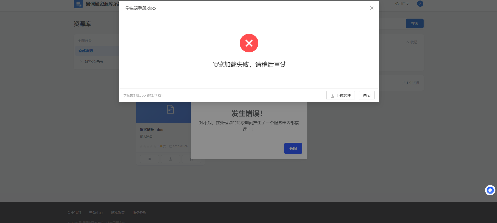

### S-05 资源下载失败 ✅

- 来源模块：学生资源库
- 原始反馈：`下载失败`
- 问题说明：截图中点击下载后，页面顶部先提示"下载失败"，随后又弹出服务器内部错误对话框，说明下载接口执行过程中发生了后端异常，而不是前端简单拦截。问题已经影响到最基础的资源获取链路。
- 影响：学生既不能预览又不能下载时，资源库的核心价值会被直接削弱。
- **修复方案**：新增 `ResourceFileController` 提供正确的文件流下载端点 `GET /api/resource-file/{id}/download`（返回 FileContentResult + Content-Disposition），前端改用浏览器原生 `<a>` 下载，同时增加资源状态校验禁止下载未审批资源。（提交: `ec1db99`）
- 截图：

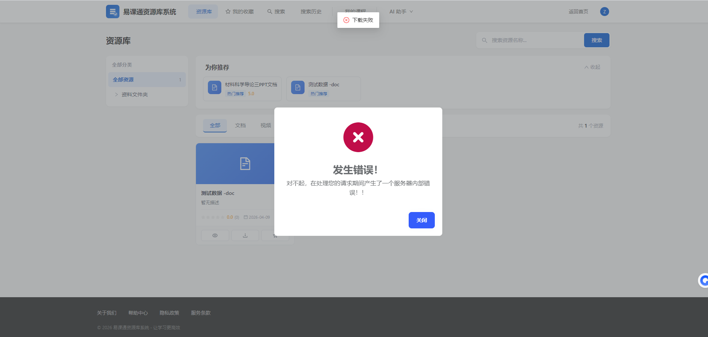

### S-06 习题页只显示章节列表，题目内容未渲染 ✅

- 来源模块：课程学习 > 习题练习
- 原始反馈：`不显示题目`
- 问题说明：截图中左侧章节列表正常出现，右侧题目区域却只有空白占位，没有题干、选项或作答区域。这说明页面并非整体未加载，而是题目详情面板的数据绑定或渲染逻辑异常。
- 影响：学生无法完成练习，课程学习链路中断。
- **修复方案**：后端 `GetRecordsByCourseAsync` 添加 CurrentUser.Id 空安全检查（修复 500 错误）；前端章节列表去重 + 加载练习记录后恢复答题状态。（提交: `9d91d4d`）
- 截图：

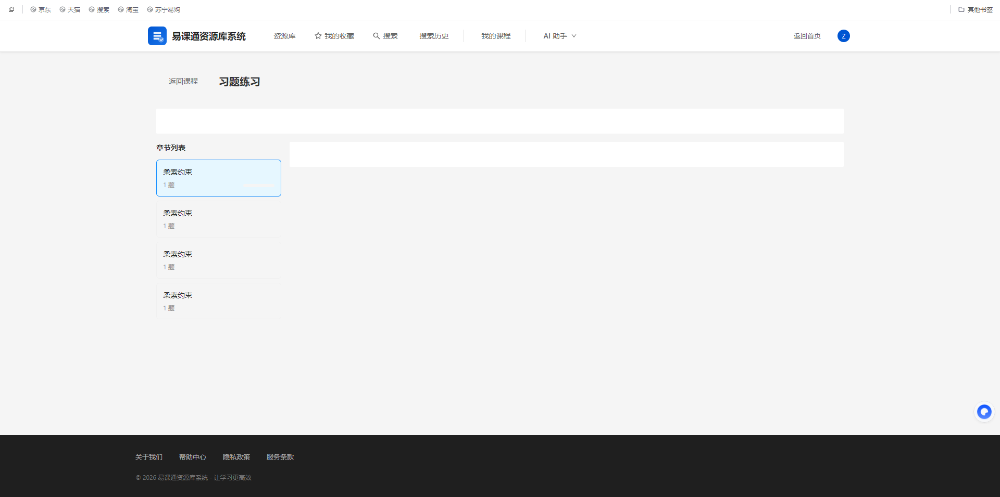

### S-07 知识图谱/思维导图区域未正常显示内容 ✅

- 来源模块：课程学习 > 习题练习/知识图谱相关页面
- 原始反馈：`不显示思维导图吗？`
- 问题说明：截图中页面左右均出现大面积空白区域，只能看到章节列表和空白内容框，没有任何思维导图或图谱结构渲染结果。这说明学生侧对应的可视化区域没有成功加载出应展示的内容。
- 影响：学生无法通过图谱方式理解章节结构，也会怀疑功能根本没有开放。
- **修复方案**：为学生端添加 `/student/knowledge-graph/:courseId` 路由，移除 `course-detail` 组件中的学生访问限制（`@if` 条件和 early return），学生可查看章节树、思维导图和知识网络图。（提交: `be68070`）
- 截图：

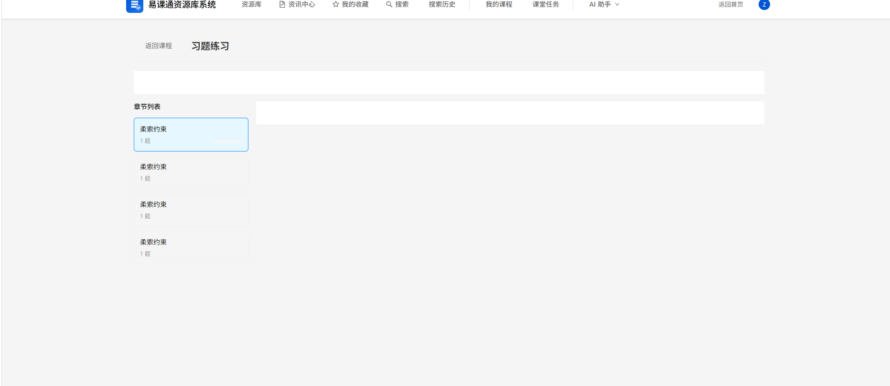

### S-08 学生端不同页面界面风格不统一

- 来源模块：学生端多个页面
- 原始反馈：`统一一下界面，不要一会这样一会那样的`
- 问题说明：截图中的“我的简历”页面使用的是偏后台管理风格的左侧深色导航和表格布局，而前面的学生资源库页面则是门户式顶部导航。对于同一学生账号来说，页面风格、导航结构和交互方式切换过于突然，给人感觉像是在多个系统之间跳转。
- 影响：整体产品一致性不足，学生学习成本升高，也会削弱系统的完成度和专业感。
- 截图：

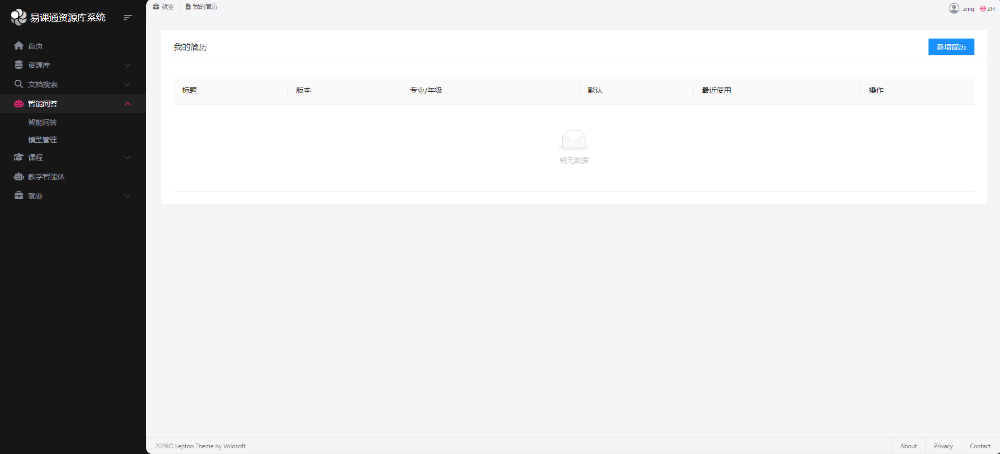
